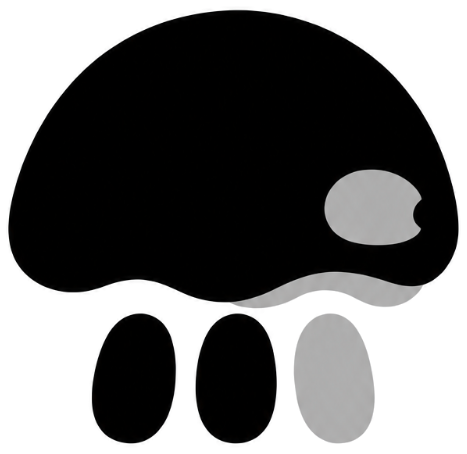

<p align="center">
  <picture>
    <source media="(prefers-color-scheme: dark)" srcset="Resources/Icons/Rendered/brand-dark.png">
    <source media="(prefers-color-scheme: light)" srcset="Resources/Icons/Rendered/brand.png">
    
  </picture>
</p>

<h1 align="center">WCLiquidGlass</h1>

<p align="center">为微信提供原生感 Liquid Glass、上下文环形菜单与 WCGlass 兼容修复。</p>

<p align="center">
  <a href="https://github.com/Ssiswent/WCLiquidGlass/releases/latest"></a>
  <a href="https://github.com/Ssiswent/WCLiquidGlass/releases"></a>
  
  
</p>

> 需要已越狱设备与可用的 tweak 注入环境。插件使用微信私有运行时接口；微信或 WCGlass 更新后，部分入口可能需要适配。

## 目录

- [快速开始](#快速开始)
- [Liquid Glass 效果](#liquid-glass-效果)
- [环形菜单与按钮动作](#环形菜单与按钮动作)
- [设置与交互](#设置与交互)
- [原生 Liquid Glass 液态面板菜单](#原生-liquid-glass-液态面板菜单)
- [素材文件保护](#素材文件保护)
- [WCGlass 共存与兼容](#wcglass-共存与兼容)
- [诊断与隐私](#诊断与隐私)
- [实现边界](#实现边界)
- [构建](#构建)

## 快速开始

1. 从 [GitHub Releases](https://github.com/Ssiswent/WCLiquidGlass/releases/latest) 下载最新的 `iphoneos-arm64` `.deb` 包并安装。
2. 确认 `WCLiquidGlass.dylib` 已注入微信，再彻底结束并重新打开微信。
3. 在微信的插件列表进入 **WCLiquidGlass**，开启“全局环形菜单”，再按需要设置按钮、材质和页面效果。

默认按钮是“插件列表”和“搜索记录”。所有配置都可在插件设置页恢复默认；环形菜单本身最多保存 **16 个动作**。

设置页底部支持“备份插件配置”和“恢复插件配置”：备份会导出带格式标识与版本号的 JSON
文件并打开系统分享；恢复使用系统文件选择器，只接受 WCLiquidGlass 配置格式，不会导入其他文件。
恢复默认和配置操作使用锚定到实际触发控件的原生 Action Sheet；日志使用导航控制器完整页面，右上角“清空”按钮使用
系统 plain `UIBarButtonItem` 与默认 `UIMenu`；有日志时显示带垃圾桶图标的“确认清空”，无日志时显示信息图标和“暂无日志”，不叠加第二个弹窗；页面背景沿用“按钮与动作”设置页。

## Liquid Glass 效果

WCLiquidGlass 的目标不是给微信覆盖一层统一模糊，而是让每个界面沿用原生几何与交互，只在正确的位置呈现可配置的玻璃材质。

### 三种可切换材质

“液态效果”控制悬浮入口、环形菜单和聊天时间条的材质取向；长按菜单可在“长按菜单液态”中单独选择：

| 模式 | 视觉取向 | 适用场景 |
| --- | --- | --- |
| 清透 | 最大程度保留底层内容和背景色 | 希望接近完全透明的玻璃 |
| 均衡 | 在可读性与透光之间保持平衡 | 日常使用 |
| 着色 | 让玻璃更明显地继承页面色彩 | 希望强化 Liquid Glass 层次 |

运行环境提供 `UIGlassEffect` 时优先使用系统真实玻璃容器与材质；不可用时自动退回 UIKit 的系统模糊材质，因此旧系统也能保持可用和可读。

### 主页、发现、通讯录与我

- **主页连续会话**：一整个连续 section 使用一张位于原生 Cell 后方的玻璃卡片，避免逐行玻璃带来的分割线、重复圆角和滚动闪烁。
- **主页独立卡片**：可单独开启圆角、左右缩进与卡片间距，让每条会话成为独立的玻璃卡片。
- **通讯录液态卡片**：保留微信原生 Cell frame 与 A–Z 索引栏空间，只呈现固定圆角的连续玻璃 section；头像仅裁切稳定外层，避免影响其它主题或插件。
- **发现与我页液态**：在不改变微信原生 Cell 几何、点击区域和内部控件的前提下，为连续列表 section 呈现固定圆角玻璃卡片，使材质与其它主页 Tab 保持一致。

### 聊天内效果

- **聊天时间条液态**：聊天中的时间提示跟随当前材质设置。
- **长按菜单液态**：在“长按菜单液态”中选择“关闭 / 透明 / 平衡 / 色调”；开启后仅接管 WCGlass 消息长按菜单的呈现层，按钮文字、图标、数量、点击与长按业务逻辑仍由微信原生菜单负责。展开和收起使用连续圆角玻璃与弹簧动画。
- **输入框工具栏**：可选地在聊天输入区顶部显示与“按钮与动作”共享配置的单层 Liquid Glass 快捷工具栏；每个 `MMInputToolView` 拥有自己的工具栏实例，工具栏使用稳定的两侧 8pt 最小边距，不读取加号、表情、发送或语音按钮的坐标，使用紧凑 Liquid Glass 按钮和系统按压反馈，随输入框位置、多行输入和输入层级内的引用内容自动过渡。工具栏不显示语音转述或斗图助手动作；这两个动作继续由环形菜单使用原有入口。工具栏宽度按按钮数量自适应，按钮不足时居中，按钮过多时保留横向滚动。工具栏占用的底部空间由聊天表格固定承载：微信每次写入 `contentInset` 或滚动指示器 inset 时，插件在写入前直接叠加工具栏空间；首次叠加或微信改变底部基线且列表原本贴底时，只在同一轮原生表格布局内消费一次新的底部锚点，消息发送、引用高度变化和异步语音转文字气泡变高时不持续改写列表偏移，继续交给微信原生实现。
- **聊天底部诊断**：页面层级诊断保留去重的键盘阶段、输入框/工具栏几何和工具栏占用 inset 记录，用于确认固定占位是否随原生输入高度更新；不在聊天列表的 `contentSize`、`contentOffset` 或滚动帧中插入持续校正逻辑。

## 环形菜单与按钮动作

菜单使用不抢焦点的透明覆盖窗口：按钮之外的触摸会继续透传给微信，键盘与普通页面交互不会被覆盖层抢走。

### 页面感知的动作筛选

用户配置的是持久化动作列表，真正展开时菜单会根据当前页面和微信原生能力动态过滤：

- 聊天专用动作只在对应聊天工具栏可用时显示。
- 主页 Tab 动作只在微信、通讯录、发现、我四个根页面显示，并自动隐藏当前所在 Tab。
- 已配置但当前页面不可用的动作不会被删除；进入支持页面后会自动恢复。
- 动作图标优先读取微信当前主题中的原生资源，缺失时才使用插件的系统图标回退。

### 可添加的动作

| 分类 | 示例 |
| --- | --- |
| 页面与设置 | WCLiquidGlass 设置、WCGlass 设置、插件列表、页面层级诊断 |
| 主页导航 | 微信、通讯录、发现、我 |
| 微信入口 | 朋友圈、视频号、照片、拍摄、扫一扫、收付款、收藏、名片 |
| 聊天工具 | 斗图助手、视频通话、红包、文件、转账、位置、翻译、搜索记录 |
| 输入辅助 | 语音转述、换行、艾特、全屏输入 |

动作真正执行时仍调用微信现有控制器或工具栏的方法；找不到原生目标时只显示中文提示，不会为了执行动作强行调用私有接口。

## 设置与交互

### 环形菜单

- 悬浮入口支持拖动，松手后自动贴靠左侧或右侧边缘；空闲时半隐藏。
- 支持点按展开，也支持长按后滑动选择动作、松手确认。
- 可选 53 / 60 / 66pt 按钮尺寸，以及双月牙、S 曲线、宽扇形、花瓣簇四种紧凑布局。
- 环形菜单始终保留完整的展开、收起、吸边与选择动画，不随系统“减少动态效果”设置降级。
- 在“按钮与动作”页进入编辑模式即可新增、删除、排序或恢复默认动作。

### 插件设置页

设置页采用原生导航、分组表格与动态颜色，提供以下配置入口：

- 环形菜单开关、按钮尺寸、紧凑布局和 Liquid Glass 材质。
- 聊天时间条液态、长按菜单液态、首页圆角与液态卡片。
- 16 个动作以内的按钮管理与顺序调整。
- 默认开启的素材文件保护、WCGlass iOS 27 兼容修复，以及统一的详细异常与原生崩溃信息采集。
- 插件配置 JSON 的备份与恢复，以及带二次确认的恢复默认设置。

## 原生 Liquid Glass 液态面板菜单

液态面板使用系统 `UIToolbar`、`UIBarButtonItem(menu:)` 和微信主题图标，不复制
菜单容器或自定义玻璃转场。按钮支持拖动、左右边缘吸附、1 秒半隐藏，并持久化左右
锚点与垂直位置；重新启动微信后不会回到右下角默认位置。

菜单在打开前按当前页面、Tab 和“按钮与动作”配置同步可用项目，只有内容真正变化时
才更新原生菜单树。隐藏按钮可选择从隐藏位置直接打开菜单，或先使用系统恢复轨迹再
打开菜单。菜单尺寸可在设置页选择 Small、Medium、Large 或自动。

完整的行为边界、同步顺序和验证清单见
[原生 Liquid Glass 液态面板菜单](docs/solutions/design-patterns/native-liquid-panel-menu.md)。

设置页的层级 UIMenu 与二级 Page Sheet 基线见[原生层级 UIMenu 与二级 Page Sheet 设置入口](docs/solutions/design-patterns/native-settings-menu-and-sheet.md)。

## 悬浮底栏

开启后，WCLiquidGlass 会在微信四个首页根页面显示 FindMyAppTabBar 风格的悬浮底栏：底部保留原生
`UITabBar` 的图标与切换行为，上滑可展开为快捷动作 Sheet。底栏支持 90pt 收起停靠点和按九宫格内容动态
测量的展开高度；九宫格动作直接复用“按钮与动作”中已启用的项目。

iOS 26 及以上使用 Liquid Glass 材质；较旧系统回退到兼容的系统模糊效果。

## 素材文件保护

微信会周期性扫描沙盒并清理未知文件。WCLiquidGlass 默认开启“素材文件保护”，完整沿用 ThemePro 已验证的处理方式：关闭微信磁盘扫描器的未知文件删除、删除上报与空文件夹清理，并拦截其规则覆盖的素材路径删除和移动操作。

- 同时覆盖微信主进程与 `com.tencent.xin.sharetimeline`。
- 开关关闭后立即恢复微信原有文件处理，不需要重启。
- 保护规则只针对 ThemePro 原有的匹配路径，不会把微信沙盒内的所有文件操作一律拦截。

## WCGlass 共存与兼容

WCLiquidGlass 可以独立使用；安装 WCGlass 后，以下能力会自动在运行时检测到对应类再生效，不会要求固定版本号或修改 WCGlass 的可见设置页。

| 场景 | WCLiquidGlass 的处理 |
| --- | --- |
| WCGlass 长按菜单液态 | 可由“长按菜单液态”选择材质或关闭接管视觉呈现，保留微信原生菜单内容与交互。 |
| iOS 27 分组返回闪退 | 针对 WCGlass 横向胶囊 / 全屏分组，在“键盘已弹出且输入框非空”的风险窗口保护过期 section 请求，不改动可见列表数据。 |
| 底栏搜索框模式切换黑屏 | 对普通四个微信 Tab 保留 WCGlass 的反馈与收起动画，但把真实页面选择收敛为一次原生 `setSelectedIndex:`，避免冷启动切换竞争。 |
| WCGlass 悬浮底栏 / Morphing 底栏 | 运行时检测到 WCGlass 底栏 overlay 存在时，WCLiquidGlass 悬浮底栏自动隐藏并恢复原生底栏，不会叠加两套底栏。 |
| WCGlass 设置入口 | 悬浮菜单从 `WCPluginsMgr` 当前公开注册的 WCGlass controller 动态解析设置控制器；无法解析或打开失败时安全回退到原生插件列表。 |
| 语音转述图标 | 显示与隐藏由 WCGlass 作者恢复的原生设置开关管理；WCLiquidGlass 不再强行改写该开关。 |

对当前 Tab 的重复点击、WCGlass 特殊选项、运行时无法确认真实 TabController 或已有切换事务等情况，兼容层会主动回退到 WCGlass 原实现。

## 诊断与隐私

- 主微信进程启动时默认自动采集尽可能详细的原生 Mach 异常和未捕获 Objective-C 异常；调试器附加时为避免 Mach handler 冲突会跳过启用。
- 日志保存在微信沙盒 `Documents/WCLiquidGlass/Diagnostics/Crashes`，可从设置页“日志”查看、删除或通过系统分享；页面层级诊断也在此列表中。
- 日志器不主动读取聊天文字、联系人、消息内容或媒体；系统生成的异常原因/对象描述可能带运行时上下文，分享前应自行确认。
- 页面层级诊断只记录 view 类名、几何、变换与裁切状态；它会遍历当前视图树，复杂页面可能需要短暂等待。
- 采集不能可靠承诺捕获 Jetsam、watchdog、用户强制结束、内核直接终止，或 `%ctor`/构造函数执行前发生的崩溃。

## 实现边界

插件以 dylib 注入微信进程。`WCLiquidGlassManager` 负责非抢焦点覆盖窗口和菜单状态；动作路由每次从当前可见控制器、聊天输入区与真实 TabController 查找可响应的微信原生对象，再通过运行时调用执行。

这带来两个设计原则：

1. **尽量复用微信的业务与交互。** 长按菜单、聊天工具、页面跳转和 Tab 切换不在插件内复制业务实现。
2. **只在确认安全的范围内兼容其它插件。** 对 WCGlass 的修复均有运行时存在性、页面状态和回退条件，不满足条件时保持原行为。

更详细的实现说明：

- [主页与通讯录液态玻璃 section](docs/solutions/architecture-patterns/home-and-contacts-liquid-glass-sections.md)
- [页面感知动作筛选](docs/solutions/design-patterns/page-aware-action-filtering.md)
- [设置页 Liquid Glass UI](docs/solutions/design-patterns/liquid-glass-settings-ui.md)
- [WCGlass 上游版本演进与可复用设计学习](docs/solutions/architecture-patterns/wcglass-upstream-evolution-learning.md)
- [WCGlass 3.0.1 主页加号菜单与 iOS 27 返回修复分析](docs/solutions/integration-issues/wcglass-3.0.1-home-plus-menu-and-ios27-return.md)
- [WCGlass iOS 27 返回兼容修复](docs/solutions/integration-issues/wcglass-ios-27-stale-section-return-crash.md)
- [WCGlass 底栏搜索框切换黑屏修复](docs/solutions/integration-issues/wcglass-search-tab-bar-cold-start-black-screen.md)
- [ThemePro 等价素材文件保护](docs/solutions/integration-issues/themepro-material-file-protection.md)

## 构建

```sh
export THEOS="$HOME/theos"
make clean package FINALPACKAGE=1
```

普通构建默认沿用 `control` 中的版本号，不会自动改写版本文件，也不会上传任何包；它只用于中间验证。需要安装到手机的最终构建使用：

```sh
scripts/build-device-package.sh
```

每次最终修改先显式执行 `sh scripts/bump-version.sh --apply`，补充同版本的 `CHANGELOG.md` 条目，并提交、推送到 `main` 后再构建 `.deb`。该命令只在构建成功后分发一次：本地 HTTP 服务可访问时上传至 `/Plugins/`；只有服务无法连接时才推送对应 tag，由 GitHub Actions 构建并创建 GitHub Release。HTTP 可达但上传冲突或服务器错误会直接失败，不会改走 GitHub。HTTP 分发会先校验同名文件的 SHA-256，相同文件跳过，不同文件拒绝上传，必须先升级 `control` 的版本号，避免生成 `(1)` 重复包或同版本不同二进制。已有 GitHub Release 或资产不会被覆盖。

项目输出 rootless `iphoneos-arm64` `.deb` 包，发布版本与历史安装包请见 [GitHub Releases](https://github.com/Ssiswent/WCLiquidGlass/releases)。

### 版本与 Tag

`control` 的 `Version` 是唯一包版本来源；GitHub tag 和 Release 状态由它自动推导，禁止手工拼接另一套版本名。

`Version` 只能是 `MAJOR.MINOR.PATCH`，例如 `2.0.0`；对应 tag 必须是 `v2.0.0`。本地脚本和 GitHub Actions 都会拒绝后缀、手工 tag 和缺少对应 `CHANGELOG.md` 条目的发布。仅推送这个纯版本 tag 会触发 Actions；工作流在安装 Theos 和编译前校验 tag、`control` 和更新日志，然后创建新的 latest Release，绝不覆盖已有 Release 或资产。
