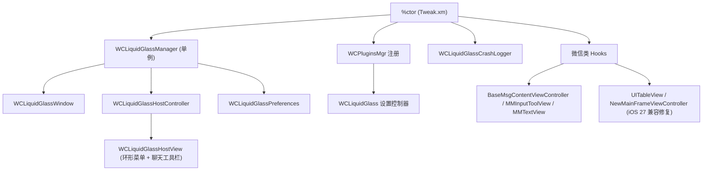

# WCLiquidGlass

独立的微信 Liquid Glass 全局环形菜单插件。

## 功能

- 使用不抢焦点的透明 `UIWindow`，在微信任意界面显示可拖动边缘入口。
- 使用 `UIGlassContainerEffect` 组合多个 `UIGlassEffect` 圆形按钮。
- iOS 16–25 自动降级为 `UIBlurEffect`。
- 支持 53/60/66pt 圆形按钮、弧形扇出、1.5 倍选中缩放和弹簧动画。
- 使用渐变背景、原生玻璃卡片、标准导航栏与 iOS 26 Liquid Glass 按钮构建设置界面，旧系统自动降级。
- 支持新增、删除、排序和隐藏按钮，并可为每个槽位选择标签页、微信入口或聊天工具动作。
- 每次展开时按当前页面的实际能力过滤动作，不支持的按钮会暂时隐藏，进入支持页面后自动恢复。
- 可在聊天输入区顶部显示原生玻璃工具栏，复用“按钮与动作”的配置并随多行输入、引用内容和键盘转场平滑跟随。
- 收起状态固定使用微信“插件”猫咪图标，展开时显示关闭图标。
- 支持点击展开、长按滑动选择，以及拖动入口后自动吸附左右边缘。
- 提供可开关的 WCGlass iOS 27 兼容修复：在液态分组的横向胶囊或全屏分组场景下，避免聊天页键盘弹出且输入框非空时返回对话列表闪退；开关切换后立即生效。
- 提供两级崩溃诊断：默认低干扰采集 Objective-C 异常，可选完整原生崩溃采集；日志可在设置页查看、删除和系统分享。
- 诊断日志保存在微信沙盒 `Documents/WCLiquidGlass/Diagnostics/Crashes`，不主动记录聊天内容。
- 通过微信的 `WCPluginsMgr` 注册到插件列表，并传入设置控制器的类名字符串。

## 架构

`%ctor` 在微信进程启动时初始化，通过 `WCPluginsMgr` 注册设置控制器，并启动 `WCLiquidGlassManager` 单例；该单例管理不抢焦点的透明 `WCLiquidGlassWindow`，以及承载环形菜单和聊天工具栏的 `WCLiquidGlassHostController` / `WCLiquidGlassHostView`。配置由 `WCLiquidGlassPreferences` 提供，崩溃诊断由 `WCLiquidGlassCrashLogger` 负责，插件还对多个微信类进行 hook 以接入输入框、对话列表等界面。



## WCGlass iOS 27 兼容修复

该修复针对 WCGlass 在 iOS 27 上的特定兼容性闪退。

WCGlass 的“横向胶囊分组”和“全屏分组”并非仅改变主页视觉样式：它们会接管对话列表的分组状态、section header、会话筛选、横向切换和全屏展示。也就是说，微信主页的同一个对话列表会在原始列表、分组筛选后的列表及切换中的展示状态之间重建或重排。

当聊天页处于“键盘已弹出且输入框非空”的状态并返回对话列表时，iOS 27 的 `UIIntelligenceSupport` 会在页面转场中继续遍历或恢复此前记录的列表语义节点。该节点可能来自 WCGlass 分组切换前或切换中的列表结构，并保留了 section `2` 的访问路径；但此时真实对话列表已经恢复为仅有 section `0` 和 `1` 的结构。

因此，`UIIntelligenceSupport` 会继续向真实列表请求 section `2` 的行数和几何位置，最终在 `UITableViewRowData` 中触发无效 section 断言并导致微信闪退。普通“液态分组”未进入横向或全屏的列表切换路径，因此不具备这一触发条件；相同配置在 iOS 26 上也未观察到该问题。

WCLiquidGlass 的兼容开关仅在这个风险窗口内，对目标对话列表的越界 section 返回自洽的“零行、零面积”结果，使过期的语义遍历安全结束，不再进入 UIKit 的断言路径。该保护不修改 WCGlass 的可见 UI、数据源或 section 数量，不延迟导航返回，也不强制收起键盘；开关切换后立即生效。

## 构建

```sh
export THEOS="$HOME/theos"
make clean package FINALPACKAGE=1
```

项目固定输出 rootless `iphoneos-arm64` 包，只包含 `arm64` 架构。
