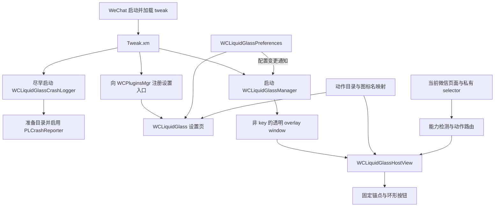
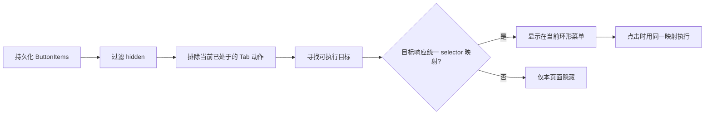
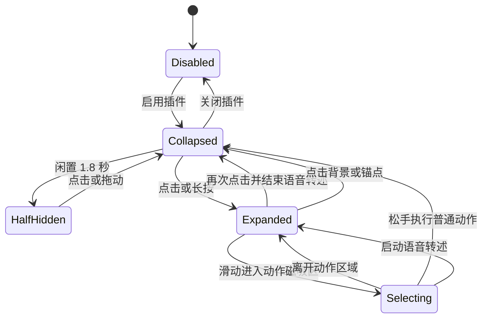

# WCLiquidGlass 插件架构与微信插件开发规范

> 当前基线：WCLiquidGlass 2.0.7（2026-08-12）
> 适用对象：继续维护本插件的开发者、Codex、Claude Code 及其他 AI 编程工具。  
> 事实来源：运行代码优先于本文，本文优先于概览型 README 和历史截图。

## Context

WCLiquidGlass 是一个注入微信进程的 rootless arm64 Theos tweak。它向微信插件列表注册设置入口，并在微信各页面之上提供一个可拖动、自动吸边、闲置半隐藏的环形快捷菜单。菜单会根据当前页面能力过滤不可执行动作，设置页则保留完整配置，避免用户配置随页面切换丢失。

本文固化已经在真机验证通过的架构、交互和 UI 契约，目标是让后续开发能够：

- 在不破坏现有行为的前提下增加动作和设置。
- 把微信私有 API 变化限制在明确的兼容层内。
- 复用微信内置主题图标，而不是用风格不一致的系统图标替代。
- 避免全局导航栏污染、手势冲突、窗口抢占和错误的页面能力判断。
- 为新的微信插件提供一套可复制但不过度耦合的工程模板。

## Guidance

### 1. 不可破坏的设计原则

1. **运行源码是最终事实来源。** README、旧截图和旧安装包可能滞后；修改前必须以当前源码和真机行为为准。
2. **微信私有 API 只能动态访问。** 使用 `NSClassFromString`、`NSSelectorFromString`、`respondsToSelector:` 和安全的动态调用，不硬链接未知类和方法。
3. **能力检测必须无副作用。** 判断动作能否显示时只能检查目标和 selector，不能尝试执行动作。
4. **可用性判断与执行共享同一份映射。** selector 不得分别维护两套，否则会出现“显示但不能执行”或“可执行却被隐藏”。
5. **保存用户意图，过滤运行时投影。** 页面不支持的按钮只在当前环形菜单中临时隐藏，不能从持久化配置中删除。
6. **动作标识符必须稳定。** 展示名称、图标和实现可以调整；已发布的 action identifier 不能随意改名，必要时必须显式迁移。
7. **悬浮层不能抢占微信。** overlay window 不成为 key window，空白区域触摸必须穿透。
8. **不注册全屏或屏幕边缘手势。** 手势只挂在插件自己的锚点和按钮上，避免与其他插件的侧滑功能冲突。
9. **不修改共享导航栏外观。** 设置页只设计自己的 table、背景和 cell；不改 `UINavigationBarAppearance`、`barStyle`、透明度、颜色或状态栏样式。
10. **运行菜单保持纯图标。** 不显示文字和角标；收起锚点使用独立、固定图标，不复用任何功能按钮图标。
11. **原生能力优先，兼容回退必须存在。** 新系统使用 Liquid Glass 相关原生类，类不存在时回退到 material blur。
12. **保持局部修改。** 不为单个动作建立无必要的框架或抽象，也不要顺手格式化既有代码。

### 2. 总体架构



架构按职责拆成以下核心源码单元：

| 文件 | 唯一职责 | 不应放入的内容 |
| --- | --- | --- |
| [`Tweak.xm`](../../../Tweak.xm) | 注入生命周期、微信进程校验、插件列表入口注册 | 设置 UI、按钮布局、动作业务 |
| [`WCLiquidGlassPreferences.m`](../../../WCLiquidGlassPreferences.m) | 动作元数据、默认配置、数据校验、迁移、持久化、变更通知 | 当前页面判断、视图布局 |
| [`WCLiquidGlassMenu.m`](../../../WCLiquidGlassMenu.m) | 图标解析、页面能力判断、动作执行、overlay、环形菜单和手势 | 设置页表格和编辑器 |
| [`WCLiquidGlass.m`](../../../WCLiquidGlass.m) | 主设置页、按钮编辑器、动作选择器、设置页视觉系统 | 全局窗口、进程入口 |
| [`WCLiquidGlassChatTime.m`](../../../WCLiquidGlassChatTime.m) | 聊天时间条的玻璃材质与布局兼容 | 环形菜单动作路由 |
| [`WCLiquidGlassHomeCorners.m`](../../../WCLiquidGlassHomeCorners.m) | 主页、发现、通讯录与我的连续 section / 独立卡片效果 | 全局导航栏外观 |
| [`WCLiquidGlassWCGlassLongPress.m`](../../../WCLiquidGlassWCGlassLongPress.m) | WCGlass 长按消息菜单呈现层兼容 | 微信菜单业务和按钮内容 |
| [`WCLiquidGlassWCGlassSearchTabBar.m`](../../../WCLiquidGlassWCGlassSearchTabBar.m) | WCGlass 底栏搜索框模式的安全 Tab 切换 | 普通页面导航业务 |
| [`WCLiquidGlassMaterialFileProtection.m`](../../../WCLiquidGlassMaterialFileProtection.m) | ThemePro 等价的扫描配置与素材路径保护 | UI、素材目录重写或额外白名单 |
| [`WCLiquidGlassCrashLogger.m`](../../../WCLiquidGlassCrashLogger.m) | 默认详细异常/崩溃采集、pending 转换、页面层级诊断与日志文件管理 | 页面功能逻辑 |

工程级文件：

| 文件 | 契约 |
| --- | --- |
| [`Makefile`](../../../Makefile) | `arm64`、iOS 16 SDK 目标、rootless、ARC、全部源码单元和所需系统 framework；普通构建不自动改写版本 |
| [`control`](../../../control) | 包名、插件名、版本、架构和依赖；唯一的包版本来源 |
| [`WCLiquidGlass.plist`](../../../WCLiquidGlass.plist) | 注入 `com.tencent.xin` 与 `com.tencent.xin.sharetimeline`；后者仅启用素材文件保护 |

### 3. 启动、注册和刷新生命周期

#### 3.1 注入入口

`%ctor` 必须先验证 bundle identifier 为 `com.tencent.xin` 或 `com.tencent.xin.sharetimeline`。主微信进程先启动 `WCLiquidGlassCrashLogger`（准备目录并尽早安装 PLCrashReporter），随后才注册偏好和安装素材保护 Hook；分享时间线进程只安装素材保护 Hook 后立即返回。只有微信主进程在主线程执行以下两项工作：

1. 启动 `WCLiquidGlassManager`，建立偏好监听和悬浮窗口。
2. 尝试通过 `WCPluginsMgr.sharedInstance` 注册插件设置入口。

注册方法为 `registerControllerWithTitle:version:controller:`。当前微信插件管理器要求 controller 参数传控制器**类名字符串**，即 `NSStringFromClass(WCLiquidGlass.class)`，不能擅自改为 `Class` 对象。调用前应继续检查方法签名和参数类型，并保留有限次数重试以及 App 回到前台后的补偿注册。

#### 3.2 配置刷新

所有持久化写入统一发出 `WCLiquidGlass.PreferencesChanged` 通知。Manager 收到通知后回到主线程刷新：

- 插件启用状态。
- 锚点边缘和纵向位置。
- 按钮尺寸。
- 当前页面可见动作。
- overlay window 的显示状态。

不要从设置控制器直接操作菜单内部视图，这会造成两个模块之间的隐式状态依赖。

### 4. 配置与数据契约

#### 4.1 偏好键

| 键 | 类型 | 默认值 | 校验规则 |
| --- | --- | --- | --- |
| `Enabled` | Bool | `NO` | 关闭时隐藏插件窗口 |
| `SizeMode` | Integer | `1` | 限制在 `0...2`，对应 53 / 60 / 66 pt |
| `CompactLayoutStyle` | Integer | `0` | 限制在四种紧凑布局枚举内 |
| `GlassAppearance` | Integer | `0` | 清透、均衡、着色三档材质 |
| `Anchor.OnLeft` | Bool | `NO` | `NO` 表示右侧 |
| `Anchor.YFraction` | Double | `0.62` | 限制在 `0.1...0.9` |
| `MaterialFileProtectionEnabled` | Bool | `YES` | 关闭时所有扫描、删除与移动 Hook 原样转发 |
| `ButtonItems` | Array<Dictionary> | 插件列表、搜索记录 | 过滤无效结构和已移除动作 |
| `Migration.SearchRecordsAdded` | Bool | `NO` | 控制一次性默认按钮迁移 |

每个按钮配置的稳定结构为：

```json
{
  "slot": "slot.固定值或UUID",
  "action": "plugins",
  "hidden": false
}
```

- `slot` 是排序和编辑身份，不等同于 action。
- `action` 是稳定动作标识符。
- `hidden` 是用户配置状态，不是页面能力状态。
- 新槽位使用 `slot.<UUID>`，不要用数组下标充当永久身份。
- 编辑器当前最多允许 16 个槽位；超过普通弧线容量时会使用用户选择的紧凑布局，并根据安全区、键盘和可用空间动态缩小按钮。

#### 4.2 迁移规则

配置演进必须遵循：

- **新增默认动作：** 使用一次性 migration flag，只为旧用户补入一次，不覆盖其排序和显隐选择。
- **移除动作：** 在配置读取校验中丢弃对应 identifier，并清理动作目录和执行路由。
- **动作改名：** 读取旧 identifier 时转换成新 identifier；至少保留一个发布周期的兼容映射。
- **恢复默认：** 同时清理业务键与相关 migration flag，使默认配置能够重新生成。

当前已彻底移除的旧动作包括粘贴、搜表情和旧搜索入口（`paste`、`emoji_search`、`search`）。`tab.0` 至 `tab.3` 已作为微信、通讯录、发现、我四个主页 Tab 的稳定 identifier 恢复使用，不得改作其它含义。

#### 4.3 配置备份与恢复

设置页提供插件配置 JSON 的备份与恢复，不包含日志、聊天内容或其它文件。导出文档使用固定的
`format`（`com.ssiswent.wcliquidglass.configuration`）、`version`（当前为 `1`）和
`preferences` 顶层结构；`preferences` 只包含本节列出的设置键。

- 导出通过系统分享面板完成，文件名和 MIME 类型应表明这是 JSON 配置文件。
- 导入先解析 JSON，再校验格式标识、版本、已知设置键、数值类型和按钮动作 identifier；失败时不写入任何偏好。
- 导入只覆盖文件中存在的合法键，缺失键保留当前值；成功后统一发送偏好变更通知并刷新相关设置页。
- “恢复默认设置”继续清理业务键和 migration flag，并使用原生确认 Action Sheet 防止误触。

### 5. 动作系统

#### 5.1 当前动作目录

动作目录是设置页、图标解析、页面过滤和执行路由的共同数据源。当前动作按用途分为：

| 分组 | identifier | 展示名称 |
| --- | --- | --- |
| 页面与设置 | `wcliquidglass_settings` | WCLiquidGlass |
| 页面与设置 | `wcglass_settings` | WCGlass |
| 页面与设置 | `page_hierarchy_diagnostics` | 页面层级诊断 |
| 主页导航 | `tab.0` | 微信 |
| 主页导航 | `tab.1` | 通讯录 |
| 主页导航 | `tab.2` | 发现 |
| 主页导航 | `tab.3` | 我 |
| 导航与入口 | `plugins` | 插件列表 |
| 导航与入口 | `moments` | 朋友圈 |
| 导航与入口 | `channels` | 视频号 |
| 聊天与工具 | `doutu_assistant` | 斗图助手 |
| 聊天与工具 | `search_records` | 搜索记录 |
| 聊天与工具 | `album` | 照片 |
| 聊天与工具 | `camera` | 拍摄 |
| 聊天与工具 | `video_call` | 视频通话 |
| 聊天与工具 | `red_packet` | 红包 |
| 聊天与工具 | `files` | 文件 |
| 聊天与工具 | `transfer` | 转账 |
| 聊天与工具 | `location` | 位置 |
| 聊天与工具 | `favorites` | 收藏 |
| 聊天与工具 | `translate` | 翻译 |
| 聊天与工具 | `scan` | 扫一扫 |
| 聊天与工具 | `payment` | 收付款 |
| 聊天与工具 | `contact_card` | 名片 |
| 聊天与工具 | `voice_input` | 语音转述 |
| 聊天与工具 | `new_line` | 换行 |
| 聊天与工具 | `mention` | 艾特 |
| 聊天与工具 | `full_input` | 全屏输入 |

动作的 identifier、标题、SF Symbol 兜底名和微信 asset 候选名集中维护。不要在 cell、orb 或执行分支里重复写展示元数据。

#### 5.2 页面感知过滤

环形菜单每次展开前重新计算可见动作：



动作目标搜索顺序包括当前可见控制器、navigation controller、tab controller、已知宿主属性以及可见 view tree。所有探测必须只做结构检查，不可调用可能弹窗、跳转或修改输入框的方法。

设置页始终展示完整动作目录；只有运行时菜单按页面过滤。这样用户可以一次配置，在进入支持页面后自动看到相应动作。

执行阶段仍保留“不支持”提示作为竞态兜底：从菜单显示到点击之间，微信页面结构可能已经变化。这个提示不是正常能力判断路径。

#### 5.3 特殊路由

部分动作不是简单 selector，需要控制器或多级回退：

- 插件列表：`WCPluginsViewController`。
- 朋友圈：`WCTimeLineViewController`。
- 视频号：优先 `openFinderTimeline`，再尝试 `WCFinderTimelineTabViewController`。
- 文件：优先页面 selector，再尝试 `LMFileBrowserViewController`。
- 斗图助手：用 `[DouTuConfig sharedConfig].DTEnabled` 读取真实启用状态，并在当前聊天输入工具响应 `doutuAction` 时显示环形动作；执行直接调用 `doutuAction`，不依赖原按钮是否可见。配置中启用该环形动作时，在 `MMInputToolView` 布局结束后隐藏 `doutuButton`，并记录其原始 `hidden` 状态，以便 WCLiquidGlass 关闭、动作隐藏或斗图助手关闭时安全恢复。
- 语音转述：只定位当前聊天页中的微信原生 `UIControl` 并发送 `UIControlEventTouchUpInside`；原按钮被其他插件隐藏、禁用或移出 view tree 时，能力判断直接过滤该动作。
- 不回退调用聊天输入工具的 `onVoiceInputButtonClicked:`。真机验证表明它与点击原生语音转述按钮的实际效果不等价。
- WeChatLiquidGlass 的 `wclg_smsVoiceTapped:` 虽然会转发到其关联的原生 control，但隐藏功能开启后对应代理 control 不在当前页面可遍历的 view tree 中，因此不作为 capability 条件或执行回退。

新增特殊路由时仍要提供无副作用的 capability 判断，并在无法构造目标时安全失败，不能假设某个私有类在所有微信版本都存在。

#### 5.4 持续型切换动作

普通动作采用“一次点击、菜单收起、延迟执行”。语音转述属于持续型切换动作，交互契约不同：

- 首次点击原生语音转述按钮后，菜单保持展开，当前 orb 显示绿色激活描边。
- 再次点击同一 orb 时触发原生按钮退出转述，并自动收起菜单。
- 点击背景或关闭锚点只收起菜单，不结束微信正在进行的转述。
- 动作显隐与视觉激活态必须分离：原生 control 是否存在决定动作显隐，插件触发和当前聊天文本控件的手动编辑方法共同维护绿色描边。
- 当前微信环境的两阶段真机调用记录表明：空输入框首次转述通常只产生 `MMTextView` 文字变化通知；输入框已有文字并从光标处再次转述时，也会同步调用 `insertText:`，但调用栈明确经过 `MMGrowTextView MMDictationLogicIcon_replaceRange:withText:`。键盘手动输入不经过该方法，即使由 `WCGlass.dylib` 转发也直接进入 UIKit 输入链。
- 插件在 `MMDictationLogicIcon_replaceRange:withText:` 的同步调用范围内维护线程局部嵌套计数。该范围内触发的 `insertText:` 属于转述，不发送手动编辑事件；范围外的 `insertText:`、`deleteBackward` 和 `setMarkedText:selectedRange:` 才视为手动编辑。
- 宿主收到手动编辑事件后，仍需确认事件对象是当前聊天输入框且语音转述处于激活态，再立即取消绿色描边。其他页面文本控件不会影响状态。
- 状态同步是事件驱动的，不持续轮询微信，不比较不稳定的按钮图片、颜色或动画，也不读取版本相关的私有关联对象。
- 输入框文字变化只作为延迟复查能力的触发信号，不能直接决定动作显隐。微信可能在语音转述产生文字后继续保留原生 control，也可能在从空输入框开始手动输入后移除它。
- 原生 control 存在时保留或加入语音转述 orb；原生 control 消失时才移除。菜单展开期间，移除的 orb 淡出，新增 orb 从锚点淡入，其余按钮使用弹簧动画沿新弧线重新排布；只改变运行时投影，不修改用户保存的按钮配置。
- 当前页面找不到原生 control 时直接过滤动作；执行阶段仍保留竞态错误提示。

此设计把真实功能状态交给微信，只让插件维护最低限度的交互反馈，避免持续轮询和不可靠的状态猜测。参考插件 `WeChatLiquidGlass2.7-3` 的二进制仍用于确认原生触发原则：代理方法 `wclg_smsVoiceTapped:` 取回关联的原生 control，再发送 `UIControlEventTouchUpInside`。

#### 5.5 故障复盘：区分语音转述写入与手动键盘编辑

这次问题的表象是绿色激活描边与微信真实转述状态不同步。第一次从空输入框启动转述后，键盘手动输入能够正确取消描边；但输入框保留文字并第二次启动转述时，转述刚写入一个字，描边就会被错误取消。该问题最初在 WCLiquidGlass 1.4.16 的真机测试中确认解决；当前实现继续保留相同的事件边界。

**关键诊断结论**

只观察输入框文字变化无法判断文字来源。同一个 `MMTextView` 的变化既可能来自语音转述，也可能来自键盘、删除、输入法组词或其他 tweak 转发。第一次空输入框转述通常只产生文字变化通知；输入框已有文字时再次转述，微信会进入以下同步调用链：

```text
MMGrowTextView MMDictationLogicIcon_replaceRange:withText:
  -> 微信内部转述写入
    -> UITextView insertText:
```

手动键盘输入也可能进入 `UITextView insertText:`，并可能经过其他 tweak，但不会经过 `MMDictationLogicIcon_replaceRange:withText:`。因此，`insertText:` 不是足够精确的事件边界；包住它的微信转述方法才是来源边界。

**没有奏效或不应进入生产环境的方案**

- 仅监听 `UITextViewTextDidChangeNotification`：只能证明文字变了，无法区分语音与手动输入。
- 仅 hook `insertText:`、`deleteBackward` 和 `setMarkedText:selectedRange:`：能识别首次手动编辑，却会把第二次转述内部的嵌套 `insertText:` 错判为手动输入。
- 根据原生按钮是否可见、图标、颜色或动画推断激活态：这些属性更适合判断能力是否存在，不能稳定代表转述是否正在运行，并会受微信版本和其他 tweak 影响。
- 根据调用方 dylib 名称区分来源：加载顺序、转发层和其他 tweak 版本都会改变调用栈，不应成为长期业务规则。
- 持续轮询、反复抓取调用栈或保留诊断计数：适合定位问题，不适合作为正式状态同步机制，会增加性能开销和版本脆弱性。

**最终实现模式**

[`Tweak.xm`](../../../Tweak.xm) 在微信转述写入的同步范围内维护线程局部嵌套计数：

```objc
static __thread NSUInteger WCLiquidGlassDictationWriteDepth = 0;

- (void)MMDictationLogicIcon_replaceRange:(NSRange)range withText:(NSString *)text {
    WCLiquidGlassDictationWriteDepth += 1;
    @try {
        %orig;
    } @finally {
        WCLiquidGlassDictationWriteDepth -= 1;
    }
}
```

所有可能代表手动编辑的输入方法统一经过一个轻量入口；只要仍处于微信转述写入范围，就忽略其内部嵌套调用：

```objc
static void WCLiquidGlassReportManualTextEdit(id inputView) {
    if (WCLiquidGlassDictationWriteDepth > 0) {
        return;
    }
    [NSNotificationCenter.defaultCenter postNotificationName:WCLiquidGlassManualTextEditNotification
                                                      object:inputView];
}
```

这里使用线程局部计数而不是全局布尔值，原因有三点：

1. 调用栈证明转述方法与嵌套 `insertText:` 是同线程同步发生的，线程局部状态正好覆盖真实生命周期。
2. 计数支持潜在的嵌套调用；布尔值在重入时可能过早清零。
3. `@try/@finally` 保证 `%orig` 即使异常退出也会恢复计数，避免后续手动输入被永久误判为语音写入。

[`WCLiquidGlassMenu.m`](../../../WCLiquidGlassMenu.m) 收到手动编辑通知后还要做两层过滤：事件对象必须是当前聊天输入框，并且插件的语音转述视觉态当前确实处于激活状态。通过后只取消绿色描边，不在全局文本控件上做额外工作。

**可复用诊断流程**

遇到“相同 UI 变化可能来自多个来源”的微信私有功能时，按以下顺序处理：

1. 先构造最小、可重复的两阶段场景，分别捕获正确路径和误判路径。
2. 在最靠近公共输入接口的位置记录完整调用栈，不要仅记录文字变化次数。
3. 对比两条栈，寻找只包围目标来源、同时不包围用户操作的最窄同步边界。
4. 用线程局部作用域标记来源，再让公共 hook 只负责发送语义明确的事件。
5. 宿主层继续校验当前页面、目标控件和本地状态，避免全局 hook 扩大影响面。
6. 真机确认后移除调用栈、日志、计数面板和诊断弹窗，只保留事件驱动的最小实现。

**回归测试顺序**

1. 空输入框启动语音转述并说话，绿色描边保持。
2. 使用键盘输入、删除或输入法组词，绿色描边立即取消。
3. 保留输入框已有文字，再次启动语音转述并从光标处写入，绿色描边继续保持。
4. 第二次转述期间再次手动输入或删除，绿色描边立即取消。
5. 在非聊天页面和其他文本控件中输入，不改变语音转述 orb 状态。
6. 重启微信后重复上述流程，确认结果不依赖一次运行中的残留状态。

这一模式适用于同步、可嵌套的私有输入链。如果未来微信把转述改为跨线程或异步回调，线程局部作用域将不再覆盖完整写入周期，必须重新抓取调用栈寻找新的来源边界，不能继续追加延时或猜测规则。

### 6. 微信原生图标解析规范

图标必须优先复用微信主题素材，保持 WCPulse/LiquidUI 已验证的黑灰双色原生风格。完整解析顺序为：

1. 从 `MMServiceCenter` 获取 `MMThemeManager`。
2. 依次查询动作配置的微信 asset 候选名，优先 `drawer_<name>`，再查原始名称。
3. 优先请求动态黑/白主题色的 SVG 图标。
4. SVG 不可用时尝试同名 `UIImage` asset。
5. 对微信、通讯录等原生 Tab 类动作，可从当前 tab item/view 提取图标。
6. 微信素材仍不可用时，使用动作目录中的 SF Symbol 兜底。
7. 最后才显示 `questionmark.circle`，便于发现缺失映射。

渲染规则：

- 微信主题素材通常使用 `UIImageRenderingModeAlwaysOriginal`，保留素材内部黑灰层次。
- 斗图助手使用插件自带位图：浅色优先 `dt_icon.png`，深色依次尝试 `dt_dark_icon.png` 和安装包实际使用过的 `dt_icon_dark.png`；依次查找 rootless `/var/jb/Library/PreferenceLoader/Preferences/`、rootful `/Library/PreferenceLoader/Preferences/` 和微信 app bundle。
- 只有明确需要统一 tint 的素材才使用 template 模式。
- 插件列表动作的猫形图标是特殊模板处理，不应拿它作为收起锚点。
- 收起锚点固定使用独立候选 `icons_filled_more`，失败时回退 `ellipsis.circle.fill`。
- 关闭按钮先查微信候选素材；不存在时使用与现有粗细、圆角和双色关系一致的自绘图标，不直接放一个尺寸突兀的文本“×”。

新增动作时，必须先研究微信/WCPulse 已有 asset 名称，再选择 SF Symbol 兜底。图标解析的进一步细节见[微信原生图标解析与映射](../design-patterns/wechat-native-icon-resolution.md)。

### 7. 悬浮窗口、环形菜单与手势

#### 7.1 Window 和触摸穿透

- window level 为 `UIWindowLevelAlert + 1`。
- 使用前台 active `UIWindowScene`，窗口覆盖 scene 全部 bounds。
- 自定义 window 必须拒绝成为 key window。
- `hitTest:` 命中窗口自身或非插件空白区域时返回 `nil`。
- HostView 只接受锚点、动作 orb 和菜单展开时的关闭背景触摸。

这些约束保证微信输入框、列表滚动、系统返回手势和其他插件按钮不会被透明窗口吞掉。

#### 7.2 状态与动画



稳定视觉参数：

| 项目 | 当前值/规则 |
| --- | --- |
| 按钮直径 | 紧凑 53 pt、标准 60 pt、宽松 66 pt |
| 图标尺寸 | 约为按钮直径的 54% |
| 选中缩放 | orb 约 1.5 倍，图标相对缩至约 0.82 |
| 闲置隐藏延迟 | 1.8 秒 |
| 吸边可见位置 | 距安全边缘约 12 pt |
| 半隐藏位置 | 锚点中心吸附到屏幕边缘 |
| 环形间距 | 至少 `diameter + 10`，并按按钮数动态放大 |
| 布局安全边距 | 约 18 pt，避开上下安全区 |
| 选择磁吸阈值 | 约 1.35 倍按钮直径 |

键盘出现时，HostView 监听 `UIKeyboardWillChangeFrameNotification` 与 `UIKeyboardWillHideNotification`，把键盘顶部作为临时的布局下边界，并按剩余高度压缩纵向间距。锚点和已展开的动作 orb 必须使用通知携带的动画时长与曲线同步移动；键盘收起后恢复用户保存的锚点位置。不要把键盘避让后的临时位置写回偏好设置，也不要通过定时器轮询键盘。

单个 `UIGlassEffect` 必须关闭 `interactive`，由磁吸索引统一控制选中反馈；否则系统按压态会持续绑定到触摸起点，即使手指已经滑到其他按钮，起点按钮或锚点仍会参与玻璃融合。按住拖动时，起始按钮在按钮间空隙中继续保持放大和方向拉伸；只有进入另一个按钮或返回悬浮入口的磁吸范围时，旧按钮才弹簧回落并把按压状态交给新目标。松手、取消、折叠和进入后台都必须清理形变状态。闲置任务使用 generation token 作废旧的延迟 block，避免快速展开/拖动后旧任务突然把锚点藏起。普通动作执行前先播放收起与选中反馈，约 0.22 秒后再调用微信动作；持续型切换动作立即调用原生 control，以便菜单同步呈现激活状态。

#### 7.3 手势边界

- 轻点锚点：展开/收起。
- 拖动锚点：闭合时移动并保存最近边缘与 y fraction，松手吸边。
- 展开后拖动：选择磁吸到的动作，松手执行。
- 长按锚点：展开并进入连续选择。
- 轻点动作：执行。
- 菜单已展开时长按任意动作：从该动作进入连续选择；手指移出原按钮后仍持续跟踪，在动作间滑动时复用与锚点长按相同的磁吸、缩放和玻璃融合反馈，松手执行当前动作。
- 点击展开背景：关闭。
- gesture delegate 不允许多个插件内手势同时识别。

禁止在 window、根 view 或屏幕边缘安装额外的 pan/edge recognizer。

### 8. 设置页 UI 规范

#### 8.1 导航

设置页和子页面使用微信提供的 navigation controller 原生 push/pop：

- 保留系统/宿主返回按钮和侧滑返回。
- 不自行绘制全局导航栏背景。
- 不在 `viewWillAppear:` 或 `viewDidAppear:` 修改 navigation bar appearance。
- 不用 scroll delegate 根据滚动位置改变导航栏颜色。
- 不缓存并恢复共享导航栏样式，因为“恢复”时机仍可能污染其他页面。

曾经出现的“刚打开正常、下拉后导航栏变黑”和“退出后其他页面被污染”都源于干预共享导航栏。正确做法是完全交给微信/系统管理。详见[原生导航栏下拉变黑问题](../ui-bugs/native-navigation-bar-turns-black-after-scrolling.md)。

#### 8.2 页面结构

所有设置控制器使用 `UITableViewStyleInsetGrouped`，内容分区采用圆角 card，而不是散落在背景上的裸 cell：

- 主设置页：品牌信息卡、菜单、内容、维护。
- 按钮与动作页：介绍卡、当前按钮 card、管理 card。
- 动作选择页：按“导航与入口”“聊天与工具”分组。
- 主设置页不提供“立即展开菜单”按钮；运行入口只存在于全局悬浮锚点。
- 按钮编辑页底部已有“添加按钮”入口，顶部导航栏不重复放添加按钮。
- 添加按钮时过滤全部已占用动作；替换动作时过滤其他槽位的动作并保留当前选择，保证一个动作最多对应一个按钮。
- 当前按钮列表不显示“第 x 个按钮”之类的冗余序号，顺序由列表位置和编辑排序直接表达。

#### 8.3 视觉 token

| 元素 | 规范 |
| --- | --- |
| 背景 | 动态浅暖色/深色渐变，只属于当前 view |
| 普通 card | 连续圆角约 24 pt，动态半透明白/深色材质 |
| 品牌 header card | 连续圆角约 28 pt |
| 品牌图标 | 约 50 pt |
| 主标题 | 约 21 pt，Semibold |
| 正文标题 | 约 17 pt |
| 次要文字 | 约 14–15 pt，动态 secondary color |
| 版本 pill | 约 12 pt，显示 `Version x.y.z` |
| 列表图标上限 | 28 × 28 pt |
| 字体 | 优先 PingFang SC，缺失时回退系统字体 |
| 圆角 | 使用 continuous corner curve |

优先使用 `UIListContentConfiguration`、`UISwitch`、原生 edit/reorder/delete 和 dynamic system colors。运行时存在 `UIGlassEffect`/`UIGlassContainerEffect` 时使用原生 Liquid Glass；否则回退 material blur，不能因为系统版本不同而让页面无背景或不可读。

完整视觉细则见[设置页 Liquid Glass 设计模式](../design-patterns/liquid-glass-settings-ui.md)。

### 9. 私有 API 兼容层规范

所有微信版本相关代码必须满足：

- 先判断类是否存在。
- 先判断实例是否响应 selector。
- 动态调用前校验参数形状；必要时用方法签名区分 `Class` 和字符串。
- 对可能抛出异常的私有调用建立小范围 `@try/@catch`，失败后走下一回退。
- 多个候选 selector 按已验证优先级排列。
- 不把私有微信对象保存成跨页面长期强引用。
- 页面离开、App 切前后台或微信重建 controller 后重新解析目标。
- 兼容失败只能隐藏单个动作或显示兜底提示，不能导致整个菜单或微信崩溃。

对微信版本升级的适配，应集中修改图标候选、目标搜索和动作路由，不把版本判断散落到 UI 层。

### 10. 标准扩展流程

#### 10.1 新增动作

每次新增动作必须完成以下全部步骤：

1. 在 preferences header 中增加稳定 identifier 常量。
2. 在动作目录增加标题、SF Symbol 兜底和分类。
3. 在 asset name 映射中加入已验证的微信主题图标候选。
4. 把动作加入动作选择器对应 section。
5. 为 selector 型动作加入统一 selector 映射；特殊动作增加独立路由。
6. 确认 capability 检测不执行任何动作。
7. 确认执行阶段复用同一 selector 映射。
8. 决定是否加入默认按钮；若要影响旧用户，增加一次性迁移。
9. 在支持和不支持页面分别真机测试显示状态。
10. 测试浅色、深色、展开菜单和设置列表中的图标表现。

示意代码只表达职责，不要求为了统一而重构现有代码：

```objc
// 1. 稳定标识符
NSString * const WCLGActionExample = @"example";

// 2. 元数据和回退图标
@{ @"identifier": WCLGActionExample,
   @"title": @"示例动作",
   @"symbol": @"sparkles" };

// 3. 微信主题素材候选
WCLGActionExample: @[ @"verified_wechat_asset_name" ];

// 4. 可执行 selector 的唯一映射
WCLGActionExample: @[ @"verifiedSelector:" ];
```

#### 10.2 新增设置

1. 定义默认值和持久化键。
2. 在 preferences 提供类型明确的 getter/setter 和边界校验。
3. setter 发出统一配置变更通知。
4. 在设置页用原生组件表达，遵循现有 card/token。
5. Manager 或 HostView 监听并无重启刷新。
6. `restoreDefaults` 必须清理该键。
7. 验证旧配置缺少新键时能正确使用默认值。

#### 10.3 修改环形布局

只有在以下测试全部覆盖后才可改动按钮上限、半径、间距或缩放：

- 最小和最大按钮直径。
- 1 个、5 个和 8 个按钮。
- 左右两侧锚点。
- 屏幕顶部、中央和底部。
- 刘海/灵动岛和 Home Indicator 安全区。
- 竖屏切换页面后的重建。
- 点击、拖动、长按三种选择方式。

#### 10.4 基于本项目创建新微信插件

可以复用工程形状，但必须逐项更名和隔离：

- Theos target、package identifier、plist 文件名和过滤器。
- tweak 名、所有 Objective-C 类前缀、通知名和 preferences key 前缀。
- 插件列表标题、版本和 controller 类名字符串。
- Manager singleton、window subclass 和 window 识别逻辑。
- 安装包输出名称。

新插件仍应保持 rootless arm64、微信 bundle 过滤、动态私有 API、非 key overlay 和原生导航栏原则。不要直接共享全局通知名或通用 `NSUserDefaults` 键，防止两个插件互相刷新或覆盖配置。

### 11. 构建、发布和验收

#### 11.1 构建

从项目目录执行：

```sh
gmake clean package FINALPACKAGE=1
```

发布前确认：

- `control` 的 `Version` 是唯一版本来源。
- 每次最终修改先显式执行 `sh scripts/bump-version.sh --apply`，补充同版本的 `CHANGELOG.md` 条目，提交并推送 `main`，再构建最终 `.deb`。
- `Version` 只能是 `MAJOR.MINOR.PATCH`，例如 `1.8.2`，并发布为 tag `v1.8.2`；本地包和 GitHub Release 均不使用后缀。
- 版本到 tag 的转换和校验只能通过 [`scripts/release-version.sh`](../../../scripts/release-version.sh) 执行；不得在工作流、本地发布命令或文档中复制第二套转换规则。
- 最终构建先尝试本地 HTTP `/Plugins/` 上传；只有服务无法连接时才推送 tag 触发 GitHub Actions。HTTP 可达但上传冲突或服务器错误必须直接失败，不能回退到 GitHub。
- Actions 只响应纯版本 tag，并在安装 Theos 和编译前校验 tag、`control` 和完整 CHANGELOG 条目；它只能创建新的 latest Release，不能覆盖已有 Release 或资产。
- 插件列表右侧只显示裸版本号，由微信插件管理器负责格式。
- 设置页品牌卡显示 `Version x.y.z`。
- 产物架构为 `iphoneos-arm64`，package scheme 为 rootless。
- 最终 `.deb` 复制到 `/Users/ssiswent/Documents/AI/Plugins/`。

#### 11.2 真机验收矩阵

| 范围 | 必测项 |
| --- | --- |
| 注入 | 微信可启动；插件列表出现一次；名称和版本正确 |
| 设置导航 | 首次打开、上滑、下拉回弹、进入子页、返回、退出后其他微信页面导航栏均正常 |
| 主题 | 浅色和深色下 card、文字、图标、开关均清晰 |
| 悬浮窗口 | 不抢键盘、不阻断列表滚动、不挡系统返回、不吞空白区域触摸 |
| 手势 | 点击、拖动、长按、左右吸边、闲置半隐藏均正确；单击展开后可从任意动作长按并在动作间连续滑动；其他插件侧滑手势不冲突 |
| 动作过滤 | 支持页面显示；不支持页面提前隐藏；返回支持页面后自动恢复 |
| 动作执行 | 每个动作至少在一个支持页面执行；页面切换竞态能安全提示而不崩溃 |
| 斗图助手 | 动作选择页可添加且不能重复添加；插件开启且聊天输入工具存在时显示并可通过 `doutuAction` 唤起；原按钮隐藏且停用集成后恢复；其他页面提前过滤；浅色和深色图标正确 |
| 语音转述 | 全新空输入框显示；从空输入框手动输入且微信移除原生 control 后平滑隐藏；清空并恢复原生 control 后平滑补回；通过语音转述产生或保留文字时，只要原生 control 仍存在就继续显示；转述期间键盘手动输入导致微信退出激活态时绿色描边同步取消但动作继续显示；保留已有文字再次启动转述并从光标处写入时绿色描边保持；随后再次键盘输入时描边取消；退出并重进带草稿聊天时按原生 control 重新判断；手动收起不结束转述 |
| 键盘避让 | 菜单收起和展开两种状态下唤起、切换及收起键盘；锚点与所有 orb 均不被遮挡，动画与键盘同步且收起后恢复原位置 |
| 图标 | 环形菜单和动作选择页使用微信原生黑灰风格；无问号兜底；收起锚点不重复功能图标 |
| 配置 | 排序、显隐、替换、添加、删除、恢复默认和重启微信后持久化正确 |
| 日志 | 默认详细异常/崩溃采集、pending report 转换、20 份上限、分享、单条删除、原生 UIMenu 清空、空日志无操作和隐私边界正确 |
| 边界 | 0 个可用动作、1 个动作、12 个动作、小屏和上下安全区布局正确 |

### 12. AI 开发约束与完成定义

后续 AI 在开始修改前应先阅读本文和相关专题文档，再读取当前源码确认没有漂移。输出方案时要明确：

- 修改属于入口、preferences、menu/router 还是 settings UI。
- 是否新增或改变持久化契约。
- 是否依赖新的微信私有类、selector 或 asset。
- 不支持页面的预期过滤行为。
- 回退图标和私有 API 失败路径。
- 对导航栏、窗口触摸和其他插件手势的影响。

一项功能只有在以下条件全部满足时才算完成：

1. 编译和 rootless arm64 打包成功。
2. 没有格式化或重排无关既有代码。
3. 旧配置可读，必要迁移已实现。
4. 页面能力过滤和执行使用一致映射。
5. 微信图标素材和 fallback 均存在。
6. 设置 UI 符合现有 card、字体、动态颜色和原生导航规则。
7. 真机通过相关验收矩阵。
8. `.deb` 放入约定目录，并说明版本和文件名。
9. 若改变了架构契约或踩到新坑，同步更新本文或同级专题文档。

### 13. 已知限制与有意保留的边界

- 微信私有类、selector 和 asset 名称会随微信版本变化，无法仅靠编译保证兼容。
- 当前主要依赖真机验收，没有完整的微信私有环境单元测试替身。
- overlay 选择一个前台 active scene；若微信未来引入复杂多窗口，需要重新定义 scene 所有权。
- 动作选择器的分组为显式清单，新增动作必须手动选择分类。
- 最多 16 个按钮是经过当前普通与紧凑布局验证的产品边界，不是任意常量。
- 环形菜单不显示文字和消息角标，这是简约视觉和触摸空间的设计决定。
- 页面不支持的动作会临时隐藏；执行提示仅用于页面瞬时变化或私有 API 失效。

## Why This Matters

微信 tweak 同时跨越注入生命周期、私有 API、全局窗口、复杂手势和宿主 UI。任何一个模块越界都可能产生远大于功能本身的副作用，例如透明窗口吞触摸、屏幕边缘手势冲突、导航栏污染整个微信、私有 selector 探测时提前执行动作，或一次页面过滤永久删掉用户配置。

本规范把稳定产品行为和高风险适配点分开：preferences 保存用户意图，menu 生成页面投影，router 隔离私有 API，settings 只管理自身内容视图。这样新功能可以局部增加，微信版本变化也能局部修复。

## When to Apply

以下工作必须先使用本规范：

- 新增、移除或重命名环形菜单动作。
- 修改微信图标 asset 映射或渲染模式。
- 调整收起锚点、环形布局、动画或手势。
- 增加插件设置或重构设置页 UI。
- 适配新的微信版本和私有 selector。
- 修改插件列表注册、版本展示或注入范围。
- 以 WCLiquidGlass 为基础创建新的微信插件。

仅修改文案或已存在动作的一个安全候选 asset 时，也应至少检查对应章节的稳定契约。

## Examples

### 正确：页面不支持时只隐藏运行时按钮

```objc
NSArray *storedItems = WCLiquidGlassPreferences.buttonItems;
NSArray *visibleItems = FilterByCurrentPageCapability(storedItems);
// storedItems 不被覆盖；切换到支持页面后重新计算即可恢复。
```

### 错误：用执行结果判断可用性

```objc
// 错误：探测阶段可能已经打开页面、发送内容或修改输入框。
BOOL available = PerformActionAndSeeWhetherItWorked(action);
```

### 正确：设置页只设计自己的内容

```objc
self.tableView.backgroundView = BuildDynamicGradientBackground();
// 不访问 self.navigationController.navigationBar.standardAppearance。
```

### 错误：为解决一次滚动颜色问题修改共享导航栏

```objc
// 错误：微信复用 navigation controller 后会污染其他页面。
self.navigationController.navigationBar.barStyle = UIBarStyleBlack;
```

## Related

- [微信原生图标解析与映射](../design-patterns/wechat-native-icon-resolution.md)
- [设置页 Liquid Glass 设计模式](../design-patterns/liquid-glass-settings-ui.md)
- [按页面过滤动作的实现模式](../design-patterns/page-aware-action-filtering.md)
- [原生导航栏下拉变黑问题](../ui-bugs/native-navigation-bar-turns-black-after-scrolling.md)
- [微信注入插件的统一日志采集](two-level-crash-diagnostics.md)
- [WCGlass 在 iOS 27 从聊天页返回时的过期分区闪退](../integration-issues/wcglass-ios-27-stale-section-return-crash.md)
- [`WCLiquidGlassPreferences.h`](../../../WCLiquidGlassPreferences.h)
- [`WCLiquidGlassMenu.h`](../../../WCLiquidGlassMenu.h)
- [`WCLiquidGlass.h`](../../../WCLiquidGlass.h)
