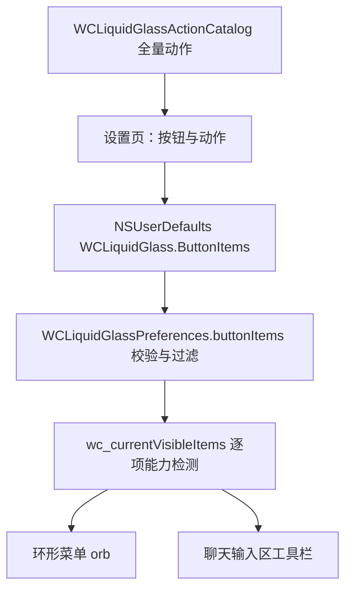

# Action Catalog & Configuration

动作目录是整个动作系统的单一事实来源，定义在 [`WCLiquidGlassPreferences.m`](https://github.com/Ssiswent/WCLiquidGlass/blob/main/WCLiquidGlassPreferences.m)，标识符常量在 `WCLiquidGlassPreferences.h`。

## 目录条目

每条目录项有三个字段：`identifier`、中文 `title`、SF Symbol 兜底 `symbol`。

```objc
NSArray<NSDictionary<NSString *, NSString *> *> *WCLiquidGlassActionCatalog(void) {
    ...
    catalog = @[
        @{@"identifier": WCLiquidGlassActionSettings, @"title": @"WCLiquidGlass", @"symbol": @"circle.grid.cross.fill"},
        @{@"identifier": WCLiquidGlassActionPlugins, @"title": @"插件列表", @"symbol": @"shippingbox.fill"},
        ...
    ];
}
```

| identifier 常量 | 值 | 标题 | SF Symbol |
| --- | --- | --- | --- |
| `WCLiquidGlassActionSettings` | `wcliquidglass_settings` | WCLiquidGlass | `circle.grid.cross.fill` |
| `WCLiquidGlassActionPlugins` | `plugins` | 插件列表 | `shippingbox.fill` |
| `WCLiquidGlassActionDoutuAssistant` | `doutu_assistant` | 斗图助手 | `face.smiling` |
| `WCLiquidGlassActionMoments` | `moments` | 朋友圈 | `circle.hexagongrid.fill` |
| `WCLiquidGlassActionChannels` | `channels` | 视频号 | `play.circle.fill` |
| `WCLiquidGlassActionAlbum` | `album` | 照片 | `photo.on.rectangle` |
| `WCLiquidGlassActionCamera` | `camera` | 拍摄 | `camera.fill` |
| `WCLiquidGlassActionVideoCall` | `video_call` | 视频通话 | `video.fill` |
| `WCLiquidGlassActionRedPacket` | `red_packet` | 红包 | `gift.fill` |
| `WCLiquidGlassActionFiles` | `files` | 文件 | `folder.fill` |
| `WCLiquidGlassActionTransfer` | `transfer` | 转账 | `arrow.left.arrow.right.circle.fill` |
| `WCLiquidGlassActionLocation` | `location` | 位置 | `location.fill` |
| `WCLiquidGlassActionFavorites` | `favorites` | 收藏 | `star.fill` |
| `WCLiquidGlassActionTranslate` | `translate` | 翻译 | `character.book.closed.fill` |
| `WCLiquidGlassActionScan` | `scan` | 扫一扫 | `qrcode.viewfinder` |
| `WCLiquidGlassActionPayment` | `payment` | 收付款 | `qrcode` |
| `WCLiquidGlassActionContactCard` | `contact_card` | 名片 | `person.text.rectangle` |
| `WCLiquidGlassActionSearchRecords` | `search_records` | 搜索记录 | `magnifyingglass` |
| `WCLiquidGlassActionVoiceInput` | `voice_input` | 语音转述 | `waveform` |
| `WCLiquidGlassActionNewLine` | `new_line` | 换行 | `return` |
| `WCLiquidGlassActionMention` | `mention` | 艾特 | `at` |
| `WCLiquidGlassActionFullInput` | `full_input` | 全屏输入 | `arrow.up.left.and.arrow.down.right` |

此外还有动态标识符 `tab.<index>`（切到微信主标签页），不在目录里，标题、图标由运行时的原生标签页推导。

查表函数在找不到时给出确定的兜底值：

```objc
NSString *WCLiquidGlassActionTitle(NSString *actionIdentifier) { ... return @"未知动作"; }
NSString *WCLiquidGlassActionSymbol(NSString *actionIdentifier) { ... return @"questionmark"; }
```

## 微信原生 asset 候选名

`WCLiquidGlassActionAssetNames` 为每个动作提供一组按优先级排列的微信资源名，供图标解析使用：

```objc
WCLiquidGlassActionMoments: @[@"icons_outlined_colorful_moment", @"icons_filled_moments", @"icons_filled_sns"],
WCLiquidGlassActionVoiceInput: @[@"icons_filled_voiceinput_white", @"icons_filled_voiceinput"],
WCLiquidGlassActionFullInput: @[@"icons_filled_maxwindow"]
```

解析顺序与回退策略见 [WeChat Native Icon Resolution](WeChat-Native-Icon-Resolution)。

## 槽位配置

用户配置保存为字典数组，每项两个字符串字段：

```objc
items = @[
    @{@"slot": @"slot.0", @"action": WCLiquidGlassActionPlugins},
    @{@"slot": @"slot.1", @"action": WCLiquidGlassActionSearchRecords}
];
```

- `slot` 只是稳定的标识，用于列表 diff 与去重；顺序由数组顺序决定。
- 设置页限制最多 12 个：`static const NSUInteger WCLiquidGlassMaximumButtonCount = 12;`
- 新增槽位在 `WCLiquidGlass.m` 中以 `slot.<uuid>` 形式生成。

## 从配置到可见按钮



`buttonItems` 读取时会剔除非法项与已下线动作，空结果回退默认值，详见 [WCLiquidGlassPreferences Persistence Layer](WCLiquidGlassPreferences-Persistence-Layer)。运行时进一步过滤：当前标签页对应的 `tab.N` 动作会被隐藏，不可用动作也不会出现。

## 迁移

`search_records` 是后加入的动作。`WCLiquidGlassMigrateButtonItemsIfNeeded` 用 `WCLiquidGlass.Migration.SearchRecordsAdded.V2` 标记，只对已有配置追加一次：

```objc
NSMutableArray *migratedItems = [storedItems mutableCopy];
[migratedItems addObject:@{@"slot": @"slot.search_records",
                           @"action": WCLiquidGlassActionSearchRecords}];
```

## 相关页面

- [Page-Aware Action Filtering and Execution](Page-Aware-Action-Filtering-and-Execution)
- [Settings UI](Settings-UI)
- [Glossary](Glossary)
