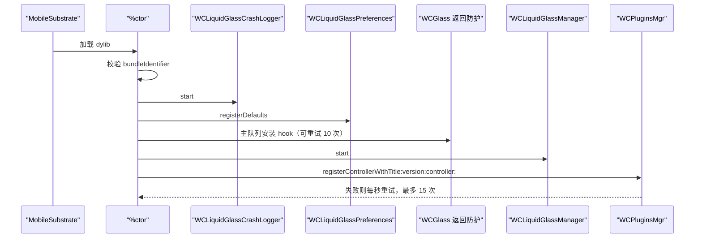
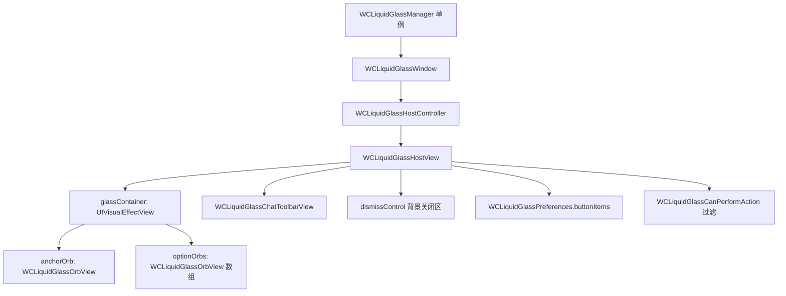
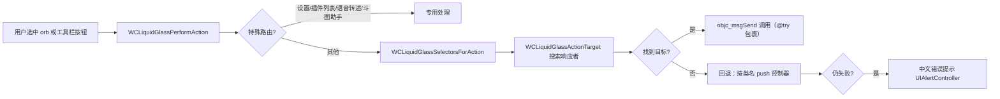

# Architecture Overview

WCLiquidGlass 是单个 dylib，被注入微信进程后在宿主 UI 之上运行一层完全独立的覆盖窗口，并通过 Objective-C runtime 调用微信自身的私有方法来执行动作。它不修改微信的数据源、导航栈或视图层级（唯一例外是 iOS 27 兼容防护中对越界 section 的只读拦截）。

## 模块划分

| 文件 | 职责 |
| --- | --- |
| `Tweak.xm` | `%ctor` 引导、Logos hook、`WCPluginsMgr` 注册、WCGlass 返回防护、语音转述写入深度追踪 |
| `WCLiquidGlassMenu.m` | 布局算法、玻璃效果、图标解析、动作能力检测与执行、orb 视图、聊天工具栏、HostView/Window/Manager |
| `WCLiquidGlassPreferences.m` | 动作目录、微信 asset 候选名、`NSUserDefaults` 持久化、迁移 |
| `WCLiquidGlass.m` | 设置页、按钮编辑页、动作选择页、崩溃日志页 |
| `WCLiquidGlassCrashLogger.m` | 未捕获异常处理、事件环形记录、PLCrashReporter 集成、日志文件管理 |
| `WCLiquidGlassIconAssets.c` | 由渲染脚本生成的 PNG 字节数组 |

## 启动序列



## 运行时对象图



- `WCLiquidGlassManager` 是唯一入口，负责窗口生命周期、偏好变化重载与前后台响应。
- `WCLiquidGlassHostView` 承载所有交互，`hitTest:` 只在工具栏、orb 或展开态背景处返回视图。
- 详见 [WCLiquidGlassManager and Window Layer](WCLiquidGlassManager-and-Window-Layer)。

## 动作派发链



完整规则见 [Page-Aware Action Filtering and Execution](Page-Aware-Action-Filtering-and-Execution)。

## 玻璃效果的降级策略

`WCLiquidGlassMakeEffect()` 优先使用运行时存在的 `UIGlassEffect`，否则回退 `UIBlurEffect`；`WCLiquidGlassMakeContainerEffect()` 在存在 `UIGlassContainerEffect` 时用 8 pt spacing 让相邻 orb 融合：

```objc
static UIVisualEffect *WCLiquidGlassMakeEffect(void) {
    Class glassClass = NSClassFromString(@"UIGlassEffect");
    SEL factorySelector = NSSelectorFromString(@"effectWithStyle:");
    if (glassClass != Nil && [glassClass respondsToSelector:factorySelector]) { ... }
    ...
}
```

因此在 iOS 16–25 上界面仍然可用，只是没有 Liquid Glass 融合效果。

## 设计约束

- 覆盖窗口不能成为 key window，不吞掉微信触摸。
- 所有微信私有调用都要先 `NSClassFromString` / `respondsToSelector:`，再用 `@try/@catch` 包裹。
- 能力检测阶段绝不执行动作，只判断目标是否存在。
- 兼容性失败只隐藏单个动作或弹出提示，不允许扩大成崩溃。

这些约束的完整表述见 [Plugin Development Specification](Plugin-Development-Specification)。

## 相关页面

- [Getting Started and Build System](Getting-Started-and-Build-System)
- [WeChat Runtime Hooks](WeChat-Runtime-Hooks)
- [iOS 27 Compatibility Guard](iOS-27-Compatibility-Guard)
- [Glossary](Glossary)
