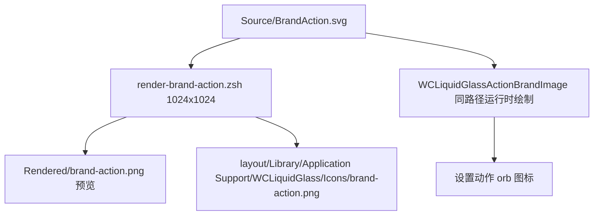

# Brand & BrandAction Icon Design

WCLiquidGlass 的自有图标遵循一套统一的视觉语言：**双层几何 + 双色**。完整规范见仓库内 `docs/solutions/design-patterns/wcliquidglass-icon-design-system.md`。

## 双层双色语言

以 `Source/menu.svg` 为例：

```xml
<svg xmlns="http://www.w3.org/2000/svg" viewBox="0 0 100 100">
  <g fill="#b9b7b2"> ...后层六个圆... </g>
  <g fill="#050505"> ...主层六个圆（略微内收）... </g>
  <circle fill="#b9b7b2" cx="50" cy="50" r="8"/>
</svg>
```

- 主层 `#050505`（近黑），承载图形语义。
- 后层 `#b9b7b2`（暖灰），错位少许，制造纵深。
- 深色母版（`Source/dark/`）保持**完全相同的几何**，只把主层换成暖白、后层换成低对比灰。

`menu.svg` 的六个圆正是环形菜单本身的抽象；其余图标（size、compact-layout、actions、compatibility、crash-capture、crash-logs、restore）沿用同一语言。

## Brand

`Source/Brand.png` 是**已确认的位图母版**，是品牌唯一允许使用的形态；`Source/dark/Brand.png` 由 `render-brand-dark.py` 从它换色生成。品牌不使用 SVG 母版，避免二次绘制导致形态漂移。

设置页头部与插件列表入口都用它：

```objc
UIImage *WCLiquidGlassBrandIconImage(CGFloat size, BOOL includesBackground);
```

## BrandAction

`Source/BrandAction.svg` 是动作入口专用矢量母版：1024×1024 透明画布中保留约 660 px 宽的品牌图形，刻意留白以匹配微信素材的视觉密度。

```xml
<svg xmlns="http://www.w3.org/2000/svg" viewBox="0 0 1024 1024">
  <g transform="translate(182 191) scale(1.378)">
    <path fill="#b9b7b2" d="M232 298 ..."/>   <!-- underside -->
    <path fill="#050505" d="M123 330 ..."/>   <!-- leftTentacle -->
    ...
  </g>
</svg>
```

### 运行时按路径绘制

关键约束：**运行时不加载 PNG，而是在目标尺寸与当前屏幕 scale 上直接绘制相同路径**，避免任何位图缩放。`WCLiquidGlassActionBrandImage` 与 SVG 一一对应：

```objc
CGFloat scale = side / 1024.0;
CGContextScaleCTM(context, scale, scale);
CGContextTranslateCTM(context, 182.0, 191.0);
CGContextScaleCTM(context, 1.378, 1.378);
```

变换与 SVG 的 `translate(182 191) scale(1.378)` 完全一致，随后依次填充 `underside`、`leftTentacle`、`middleTentacle`、`rightTentacle`、`dome`、`window`、`windowCutout` 七条路径。

深浅色配色在代码里显式给出：

```objc
UIColor *black = dark ? [UIColor colorWithRed:0.949 green:0.949 blue:0.969 alpha:1.0]
                     : [UIColor colorWithWhite:0.02 alpha:1.0];
UIColor *gray = dark ? [UIColor colorWithRed:0.557 green:0.557 blue:0.576 alpha:1.0]
                    : [UIColor colorWithRed:0.725 green:0.718 blue:0.698 alpha:1.0];
```

绘制尺寸随 orb 直径变化：

```objc
image = WCLiquidGlassActionBrandImage(floor(buttonDiameter * 0.48));
```

### 资产映射



PNG 只用于预览与安装内容核验；运行时走矢量绘制这一路。

## 验收要点

- 母版改动必须同步 `Source/dark/`，且几何一致。
- 修改 `BrandAction.svg` 的路径或变换后，必须同步更新 `WCLiquidGlassActionBrandImage` 中的路径与 `translate`/`scale`，否则设置 orb 与预览会不一致。
- 预览必须用 `render-brand-action.zsh`（librsvg），不能用 Quick Look。
- 不得用截图缩放的 PNG 替代矢量绘制。

## 相关页面

- [Settings Icon Build Pipeline](Settings-Icon-Build-Pipeline)
- [WeChat Native Icon Resolution](WeChat-Native-Icon-Resolution)
- [Settings UI](Settings-UI)
