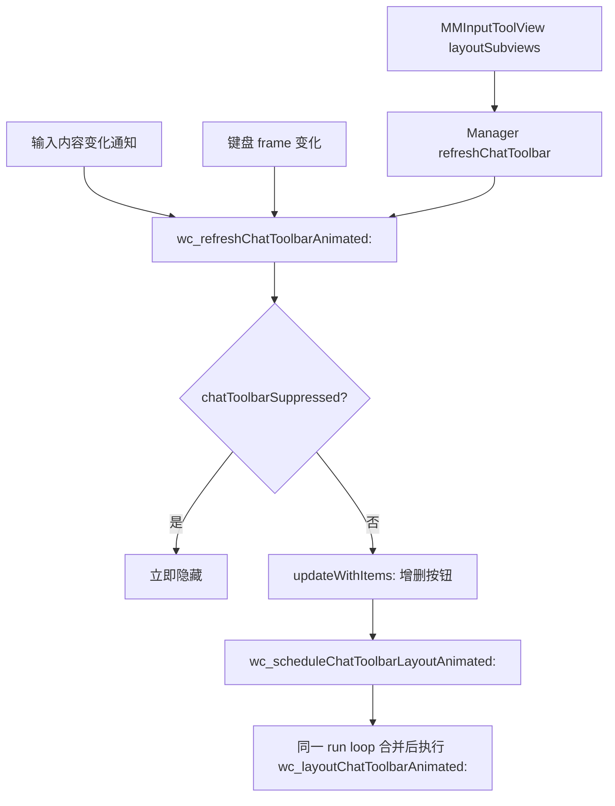

# Chat Toolbar Sub-system

聊天工具栏是覆盖层的第二个入口：在聊天页面的输入区上方显示一条横向玻璃胶囊，内容与环形菜单当前可用动作完全一致。实现分布在 `WCLiquidGlassMenu.m`（`WCLiquidGlassChatToolbarView`、HostView 中的一组 `wc_*ChatToolbar*` 方法）与 `Tweak.xm`（生命周期 hook）。

## 视图结构

```objc
@interface WCLiquidGlassChatToolbarView : UIView
@property(nonatomic, strong) UIVisualEffectView *glassView;
@property(nonatomic, strong) UIScrollView *scrollView;
@property(nonatomic, strong) NSMutableDictionary<NSString *, WCLiquidGlassToolbarButton *> *buttonsByAction;
@property(nonatomic, copy) NSArray<NSString *> *actionIdentifiers;
@property(nonatomic, copy) void (^actionHandler)(NSString *actionIdentifier);
@end
```

布局常量（`layoutSubviews`）：

| 项目 | 值 |
| --- | --- |
| 工具栏高度 | 48 pt |
| 圆角 | 高度的一半，continuous |
| 内边距 | `CGRectInset(bounds, 5, 5)` |
| 按钮边长 | 38 pt |
| 按钮间距 | 6 pt |
| 图标边长 | 按钮短边的 56% |
| 横向滚动 | `contentWidth > 可视宽度` 时启用 |

`WCLiquidGlassToolbarButton` 是 `UIControl`，按下时缩到 0.90，激活态（语音转述）图标变绿。

## 显示条件

```objc
BOOL shouldShow = WCLiquidGlassPreferences.chatToolbarEnabled &&
    hasInputToolFrame && items.count > 0;
```

`items` 就是环形菜单用的 `wc_currentVisibleItems`，因此工具栏与菜单内容天然同步，见 [Page-Aware Action Filtering and Execution](Page-Aware-Action-Filtering-and-Execution)。

## 定位

```objc
const CGFloat toolbarSideMargin = 20.0;
CGFloat toolbarWidth = MAX(0.0, CGRectGetWidth(self.bounds) - toolbarSideMargin * 2.0);
CGFloat toolbarHeight = 48.0;
CGFloat toolbarX = toolbarSideMargin;
CGFloat toolbarY = CGRectGetMinY(inputContainerFrame) - toolbarHeight - 10.0;
CGFloat minimumY = self.safeAreaInsets.top + 8.0;
if (toolbarY < minimumY || CGRectGetWidth(inputFrame) < 1.0) {
    self.chatToolbar.alpha = 0.0;
    self.chatToolbar.hidden = YES;
    return;
}
```

输入区 frame 来自 `WCLiquidGlassCurrentChatInputToolFrames`：先找到 `MMInputToolView` 类型的视图并转换 bounds；如果聊天控制器实现了返回 `CGRect` 的 `getInputToolViewFrame`（用 `NSMethodSignature` 校验返回类型是结构体后才调用），则以它为准。因此多行输入、引用消息、键盘升降都会让工具栏跟随。

## 刷新与动画时序



- `wc_scheduleChatToolbarLayoutAnimated:` 用 `chatToolbarLayoutScheduled` 合并同一循环内的多次请求，`chatToolbarLayoutAnimated` 做「只要有一次要求动画就动画」的或运算。
- 显示/隐藏用 alpha + `scale(0.96)`；位置变化用弹簧动画（0.22 s，damping 0.88）。
- `chatToolbarAppearanceTransitionActive` 为真时强制关闭动画，避免 push/pop 转场中工具栏出现漂移。
- 输入变化后额外在 0.12 s 再排一次布局（`chatToolbarLayoutGeneration` 去重），用于等待微信自身完成输入区高度动画。

## 生命周期控制

`Tweak.xm` 中 `BaseMsgContentViewController` 的四个方法分别驱动 Manager：

| Hook | 调用 |
| --- | --- |
| `viewWillDisappear:` | `hideChatToolbarImmediately`（置 `chatToolbarSuppressed = YES`） |
| `viewWillAppear:` | `beginChatToolbarAppearanceTransition` → `%orig` → `resumeChatToolbarImmediately`，并在 transition coordinator 完成回调里 `endChatToolbarAppearanceTransition` |
| `viewDidAppear:` | `resumeChatToolbarImmediately` |
| `viewDidDisappear:` | `refreshChatToolbar` |

这样离开聊天页时工具栏立即消失（而不是跟着转场滑走），返回时不带动画直接就位。

## 动作派发

按钮点击经 `actionHandler` 回到 HostView 的 `wc_toolbarActionTapped:`：语音转述在这里直接触发原生 control 并更新 orb/工具栏的激活态；其他动作调用 `WCLiquidGlassPerformAction` 后重新排布工具栏。

## 相关页面

- [WeChat Runtime Hooks](WeChat-Runtime-Hooks)
- [Orb Layout Engine and Gesture Handling](Orb-Layout-Engine-and-Gesture-Handling)
- [WCLiquidGlassPreferences Persistence Layer](WCLiquidGlassPreferences-Persistence-Layer)
