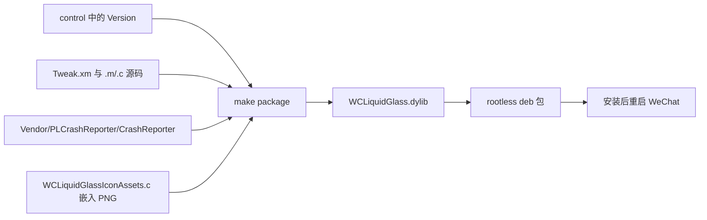

# Getting Started & Build System

本页说明如何构建、安装 WCLiquidGlass，以及构建系统各部分的作用。事实依据：[`Makefile`](https://github.com/Ssiswent/WCLiquidGlass/blob/main/Makefile)、[`control`](https://github.com/Ssiswent/WCLiquidGlass/blob/main/control)、[`README.md`](https://github.com/Ssiswent/WCLiquidGlass/blob/main/README.md)、[`WCLiquidGlass.plist`](https://github.com/Ssiswent/WCLiquidGlass/blob/main/WCLiquidGlass.plist)。

## 前置条件

- macOS + [Theos](https://theos.dev)（`$THEOS`）
- iOS SDK，deployment target 16.0
- rootless 越狱设备（`iphoneos-arm64`）与 MobileSubstrate ≥ 0.9.5000
- 修改图标时另需 `librsvg`（`rsvg-convert`）、`python3` 与 `Pillow`，见 [Settings Icon Build Pipeline](Settings-Icon-Build-Pipeline)

## 构建

```sh
export THEOS="$HOME/theos"
make clean package FINALPACKAGE=1
```

产物是 `packages/` 下的 `.deb`，安装后需要重启微信。

## Makefile 结构

```make
ARCHS = arm64
TARGET = iphone:clang:latest:16.0
THEOS_PACKAGE_SCHEME = rootless

INSTALL_TARGET_PROCESSES = WeChat

TWEAK_NAME = WCLiquidGlass

WCLiquidGlass_FILES = Tweak.xm WCLiquidGlassMenu.m WCLiquidGlassPreferences.m WCLiquidGlassCrashLogger.m WCLiquidGlass.m WCLiquidGlassIconAssets.c
WCLiquidGlass_CFLAGS = -fobjc-arc -DWCLIQUIDGLASS_VERSION=\"$(shell sed -n 's/^Version: //p' control)\" -DPLCRASHREPORTER_PREFIX=WCLG_ -I$(THEOS_PROJECT_DIR)/Vendor/PLCrashReporter/Headers
WCLiquidGlass_FRAMEWORKS = Foundation UIKit QuartzCore
WCLiquidGlass_LDFLAGS = $(THEOS_PROJECT_DIR)/Vendor/PLCrashReporter/CrashReporter
```

要点：

- `WCLIQUIDGLASS_VERSION` 从 `control` 的 `Version:` 行注入，因此**版本号只需要改 `control`**；设置页头部与向 `WCPluginsMgr` 注册的版本都取这个宏。
- `PLCRASHREPORTER_PREFIX=WCLG_` 与 vendored 静态库的符号前缀一致，避免与微信内已有的 PLCrashReporter 冲突，见 [PLCrashReporter Vendor Integration](PLCrashReporter-Vendor-Integration)。
- 图标以 C 字节数组的形式参与编译（`WCLiquidGlassIconAssets.c`），运行时不需要外部资源文件。
- 只构建 `arm64`，`THEOS_PACKAGE_SCHEME = rootless`。

## 注入过滤

`WCLiquidGlass.plist` 限定注入目标；`Tweak.xm` 的 `%ctor` 再做一次运行时校验，非微信进程直接返回：

```objc
%ctor {
    @autoreleasepool {
        if (![NSBundle.mainBundle.bundleIdentifier isEqualToString:@"com.tencent.xin"]) {
            return;
        }
        ...
    }
}
```

## 构建产物流程



## 首次使用

1. 安装 `.deb` 并重启微信。
2. 进入微信「我 → 设置 → 插件列表（WCPluginsMgr）→ WCLiquidGlass」。
3. 打开「启用全局环形菜单」——默认值为关闭，见 [WCLiquidGlassPreferences Persistence Layer](WCLiquidGlassPreferences-Persistence-Layer)。
4. 在「按钮与动作」中配置槽位，见 [Action Catalog and Configuration](Action-Catalog-and-Configuration)。

## 相关页面

- [Architecture Overview](Architecture-Overview)
- [WeChat Runtime Hooks](WeChat-Runtime-Hooks)
- [Settings UI](Settings-UI)
