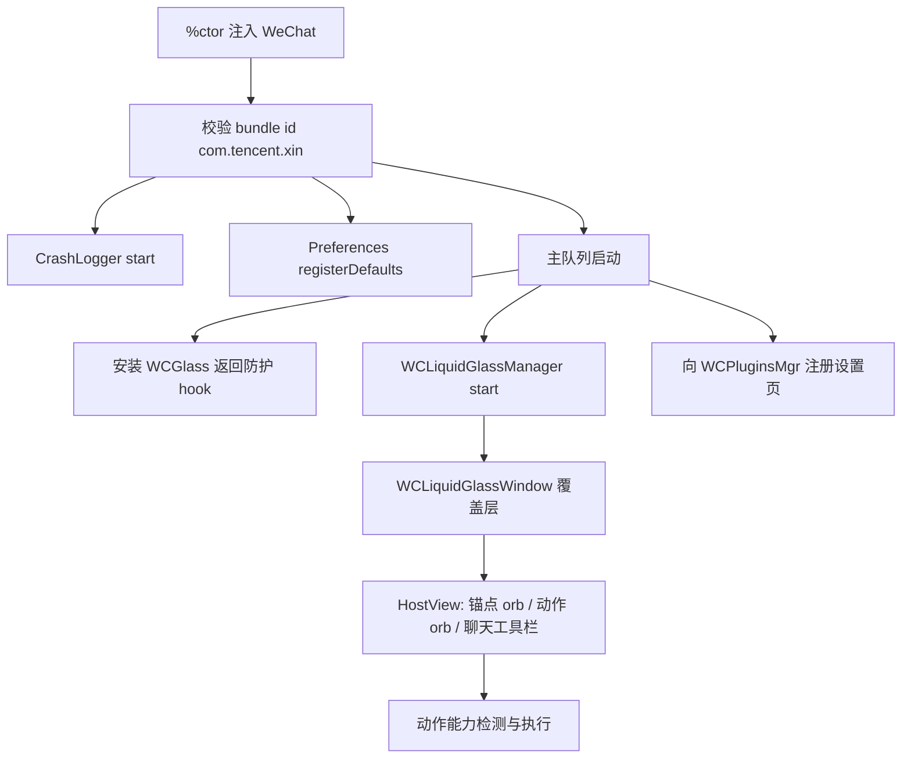

# WCLiquidGlass Overview

WCLiquidGlass 是一个注入微信（`com.tencent.xin`）的 Theos tweak，为微信提供一个独立于宿主 UI 的全局 Liquid Glass 环形菜单、聊天输入区工具栏、插件设置页、iOS 27 兼容修复和两级崩溃诊断。

包信息来自 [`control`](https://github.com/Ssiswent/WCLiquidGlass/blob/main/control)：

```text
Package: com.ssiswent.wcliquidglass
Name: WCLiquidGlass
Version: 1.6.0
Architecture: iphoneos-arm64
Depends: mobilesubstrate (>= 0.9.5000), firmware (>= 16.0)
```

## 它做什么

| 能力 | 实现位置 |
| --- | --- |
| 全局悬浮锚点 + 环形动作菜单 | `WCLiquidGlassMenu.m` |
| 聊天输入区上方的横向工具栏 | `WCLiquidGlassMenu.m`、`Tweak.xm` |
| 动作目录、按钮槽位与持久化 | `WCLiquidGlassPreferences.m` |
| 按当前页面能力过滤动作 | `WCLiquidGlassMenu.m` |
| 微信运行时 hook 与插件注册 | `Tweak.xm` |
| 设置界面（`WCPluginsMgr` 中的条目） | `WCLiquidGlass.m` |
| iOS 27 + WCGlass 返回闪退防护 | `Tweak.xm` |
| 崩溃诊断（Objective-C + PLCrashReporter） | `WCLiquidGlassCrashLogger.m`、`Vendor/` |
| 设置页图标嵌入资源 | `WCLiquidGlassIconAssets.c`、`Resources/Icons` |

## 顶层运行结构



## 页面导航

### 1. 概览

- [Getting Started and Build System](Getting-Started-and-Build-System)
- [Architecture Overview](Architecture-Overview)

### 2. 核心悬浮层

- [WCLiquidGlassManager and Window Layer](WCLiquidGlassManager-and-Window-Layer)
- [Orb Layout Engine and Gesture Handling](Orb-Layout-Engine-and-Gesture-Handling)
- [Chat Toolbar Sub-system](Chat-Toolbar-Sub-system)

### 3. 动作系统与微信集成

- [Action Catalog and Configuration](Action-Catalog-and-Configuration)
- [Page-Aware Action Filtering and Execution](Page-Aware-Action-Filtering-and-Execution)
- [WeChat Runtime Hooks](WeChat-Runtime-Hooks)

### 4. 偏好与设置 UI

- [WCLiquidGlassPreferences Persistence Layer](WCLiquidGlassPreferences-Persistence-Layer)
- [Settings UI](Settings-UI)

### 5. iOS 27 兼容

- [iOS 27 Compatibility Guard](iOS-27-Compatibility-Guard)

### 6. 崩溃诊断

- [WCLiquidGlassCrashLogger](WCLiquidGlassCrashLogger)
- [PLCrashReporter Vendor Integration](PLCrashReporter-Vendor-Integration)

### 7. 图标与资源管线

- [Settings Icon Build Pipeline](Settings-Icon-Build-Pipeline)
- [WeChat Native Icon Resolution](WeChat-Native-Icon-Resolution)
- [Brand and BrandAction Icon Design](Brand-and-BrandAction-Icon-Design)

### 8. 开发文档与工具

- [Plugin Development Specification](Plugin-Development-Specification)
- [Layout Preview Tool](Layout-Preview-Tool)

### 9. 术语

- [Glossary](Glossary)
