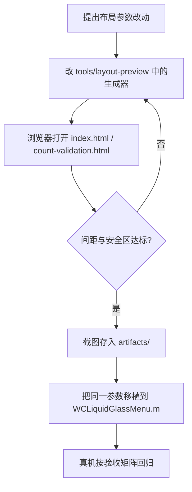

# Layout Preview Tool

`tools/layout-preview/` 是一个纯静态的几何实验室，用来在写 Objective-C 之前验证环形/紧凑布局的排布。它**不属于 tweak 运行时**，不参与构建，也不被打包。

```text
tools/layout-preview/
├── index.html             Layout Lab：四种布局的轨迹与间距回归
├── count-validation.html  Count Matrix：不同按钮数量的排布矩阵
├── shape-concepts.html    Rounded Shapes：形状概念探索
└── artifacts/             已确认的截图证据
```

用法：直接用浏览器打开 HTML 即可，无需构建或依赖。

## Layout Lab（index.html）

以真机比例复现布局条件：

```js
const WIDTH = 390;
const HEIGHT = 544;
const DIAMETER = 52;
const COUNT = 9;
const ANCHOR = { x: 38, y: 278 };
const CLEARANCE = 68;
const TARGET = 62;
const MIN_Y = 42;
const MAX_Y = 473;
```

即 390 pt 宽、9 个 52 pt 按钮、左侧锚点、515 pt 键盘边界。页面上的虚线只用于检查轨迹，不会进入插件。

它实现了与 Objective-C 侧同构的等弧长重采样：

```js
function equalArcPoints(count, sampler, samples = 360) {
  // 密集采样 -> 累计弧长 -> 按等长目标插值
}
```

四个生成器 `sCurve()`、`wideFan()`、`doubleCrescent()`、`petalCluster()` 对应四种紧凑布局，参数与运行时保持一致，例如双层月牙：

```js
const center = { x: 45, y: 0 };
const innerRadius = 68;
const outerRadius = 132;
const innerHalf = 110 * Math.PI / 180;
const alignedProjection = innerRadius * Math.cos(innerHalf);
const outerHalf = Math.acos(alignedProjection / outerRadius);
```

每个布局卡片会显示实测的按钮最小间距与锚点最近间距，作为验收指标。

## Count Matrix（count-validation.html）

按按钮数量逐一渲染（标题形如「N 个按钮 · 默认尺寸」），用于确认从少量按钮到 12 个上限的排布都不重叠、不越界。

## 工作流



## artifacts

已确认的证据截图，作为后续改动的对照基线，包括：

```text
approved-geometry.png
adaptive-counts-7-12-final.png
compact-counts-6-12-final.png
count-validation-final.png
final-compact-counts-9-12.png
final-crescent-count-8.png
final-fallback-counts-7-8.png
rounded-shape-concepts.png
```

## 注意

预览工具与运行时是两份独立实现，改动布局参数后必须**同时**更新两侧，否则 artifacts 将不再代表真实行为。

## 相关页面

- [Orb Layout Engine and Gesture Handling](Orb-Layout-Engine-and-Gesture-Handling)
- [Plugin Development Specification](Plugin-Development-Specification)
