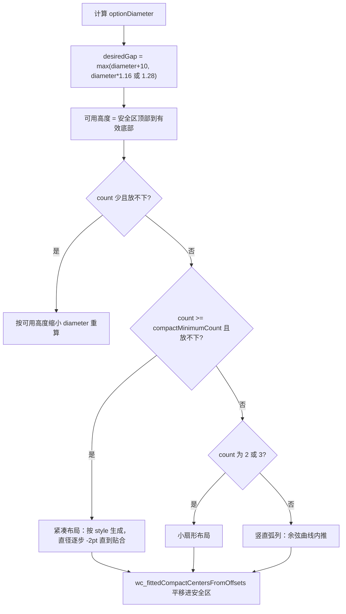
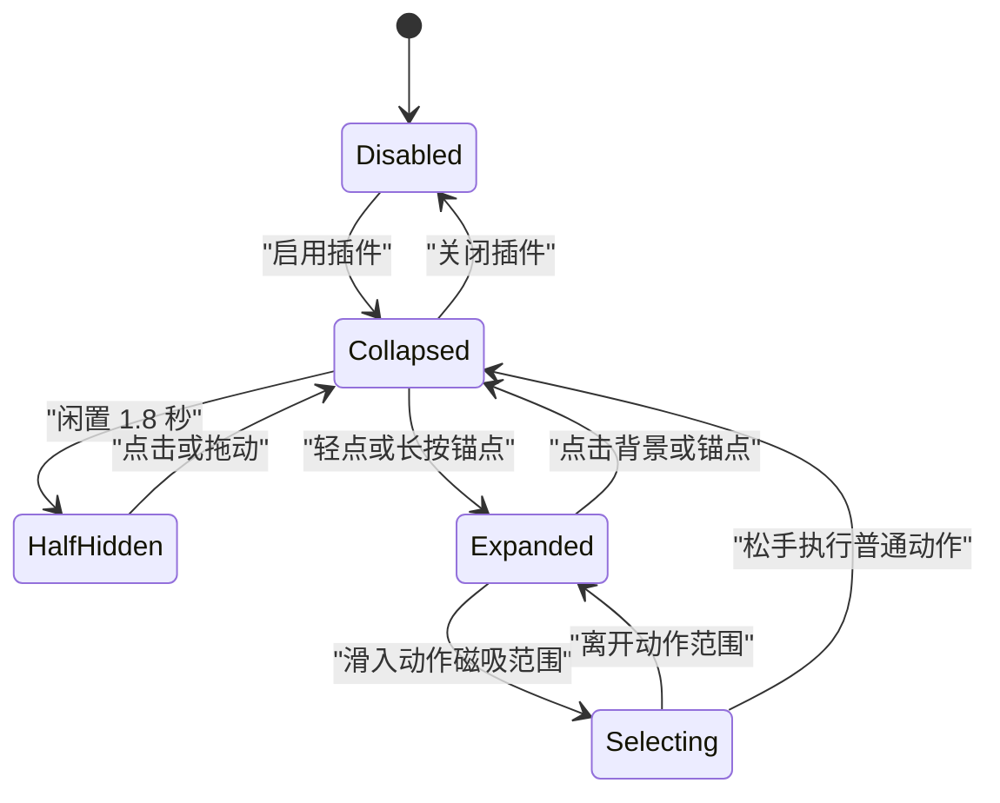

# Orb Layout Engine & Gesture Handling

本页描述 `WCLiquidGlassMenu.m` 中的 orb 视图、布局算法和手势状态机。

## 常量

```objc
static const CGFloat WCLiquidGlassContainerSpacing = 8.0;
static const CGFloat WCLiquidGlassSelectedScale = 1.5;
static const NSUInteger WCLiquidGlassCompactMinimumCount = 7;
static const NSUInteger WCLiquidGlassDoubleCrescentMinimumCount = 8;
```

按钮直径由 `sizeMode` 决定：

```objc
static CGFloat WCLiquidGlassButtonDiameter(void) {
    switch (WCLiquidGlassPreferences.sizeMode) {
        case 0: return 53.0;   // 紧凑
        case 2: return 66.0;   // 大
        default: return 60.0;  // 标准
    }
}
```

## WCLiquidGlassOrbView

继承 `UIVisualEffectView`，effect 来自 `WCLiquidGlassMakeEffect()`：

- 圆角为高度的一半，`kCACornerCurveContinuous`。
- 图标边长 `floor(diameter * 0.54)`，居中。
- 选中态：orb 缩放到 `1.5`，图标反向缩到 `0.82`，`zPosition = 30`，弹簧动画（damping 0.70 / 0.86）。
- 拖动态 `setDraggedAppearanceTowardPoint:inView:`：按手指方向做各向异性拉伸（沿向 `1 + 0.10 * progress`，横向 `1 - 0.04 * progress`）并轻微位移，动画时长 0.075 s。
- 切换类动作（语音转述）激活时加 2.5 pt `systemGreenColor` 描边，`accessibilityValue` 变为「已开启」。
- `traitCollectionDidChange:` 时重新解析图标，保证深浅色切换正确。

## 展开布局

`wc_optionCenters` 是布局主入口，流程：



要点：

- 有效底部 `wc_effectiveLayoutBottom` 取 `min(bounds 底部 - 安全区, keyboardTop)`，因此键盘弹出时菜单整体上移。
- 紧凑触发阈值随布局样式变化：双层月牙为 8，其他为 7。
- 按钮多于 8 个时直径收缩：`max(44, min(50 - (count-9)*2, preferred*0.82))`。
- 紧凑布局在 `diameter >= 40` 范围内逐步收缩直到所有圆心落在安全矩形内。

### 四种紧凑布局

```objc
typedef NS_ENUM(NSInteger, WCLiquidGlassCompactLayoutStyle) {
    WCLiquidGlassCompactLayoutStyleDoubleCrescent = 0,
    WCLiquidGlassCompactLayoutStyleSCurve,
    WCLiquidGlassCompactLayoutStyleWideFan,
    WCLiquidGlassCompactLayoutStylePetalCluster
};
```

| 样式 | 设置页标题 | 生成方式 |
| --- | --- | --- |
| DoubleCrescent | 双层月牙 | 二分搜索 span（90°–170°，50 次迭代）使内外弧半径差刚好等于目标间距，`WCLiquidGlassCrescentRadii` 求半径，再 `WCLiquidGlassAlignOffsetsToAnchorDistance` 对齐锚点净空 |
| SCurve | 流动 S 弧 | `WCLiquidGlassAppendFlowingSOffsets` |
| WideFan | 宽扇形 | 三层圆弧，`ringCounts = {1, middleCount, 其余}`，半径按 `diameter + 9` 递增，半角由 `WCLiquidGlassRingHalfAngle` 求 |
| PetalCluster | 花瓣环簇 | 单环均分；count > 8 时中心额外放一个，外围 `count - 1` 个 |

### S 曲线的等距重采样

`WCLiquidGlassEqualFlowingSPoints` 由两段三次贝塞尔拼成 S 形，对曲线采样 600 个点，按累计弧长等距重采样，再用 `WCLiquidGlassMinimumPointDistance` 检查最小圆心间距并整体缩放，保证按钮沿曲线均匀且不重叠。

## 手势状态机



手势注册：

| 手势 | 目标 | 参数 |
| --- | --- | --- |
| Tap | anchorOrb | `wc_anchorTapped:` 展开/收起 |
| Pan | anchorOrb | 收起时拖动移动锚点，展开时等价于连续选择 |
| LongPress | anchorOrb | `minimumPressDuration = 0.22`，`allowableMovement = 96.0` |
| Tap | option orb | `wc_optionTapped:` |
| LongPress | option orb | `minimumPressDuration = 0.18`，`allowableMovement = 96.0` |

`gestureRecognizer:shouldRecognizeSimultaneouslyWithGestureRecognizer:` 固定返回 `NO`，插件内手势互斥。

### 磁吸与反馈

```objc
CGFloat threshold = self.anchorOrb.diameter * (magnetic ? 1.35 : 0.65);
```

`wc_highlightNearestOrbToPoint:magnetic:` 找出阈值内最近的 orb；若锚点更近则取消高亮并把按压态交回锚点。`wc_setHighlightedIndex:` 切换选中外观并触发 `UISelectionFeedbackGenerator`。

### 拖动锚点与吸边

松手时把最近边和 y 比例写回偏好：

```objc
self.anchorOnLeft = self.anchorOrb.center.x < CGRectGetMidX(self.bounds);
CGFloat yFraction = self.anchorOrb.center.y / MAX(CGRectGetHeight(self.bounds), 1.0);
[WCLiquidGlassPreferences setAnchorOnLeft:self.anchorOnLeft yFraction:yFraction];
```

随后用弹簧动画（0.36 s，damping 0.72）吸附到 `wc_layoutAnchorFromPreferences` 计算的位置：可见时距边缘 12 pt，半隐藏时圆心贴到屏幕边缘。

### 闲置半隐藏

`wc_scheduleIdleHide` 使用自增的 `idleHideGeneration` 作为 token，1.8 秒后若 generation 未变且菜单未展开则半隐藏；`wc_cancelIdleHide` 只需自增 generation 即可作废旧任务。

## 执行与刷新

- `wc_activateOptionAtIndex:`：语音转述是切换型动作，直接触发原生 control 并保持菜单；其他动作走 `closeMenuSelectingIndex:`。
- `closeMenuSelectingIndex:` 先播放收起动画与选择反馈，`0.22 s` 后再 `WCLiquidGlassPerformAction`，并用 `contentRefreshGeneration` 和 `applicationState` 双重校验。
- 输入框内容变化时（`wc_chatInputContentDidChange:`）在 0.06 s 与 0.28 s 两个时间点尝试 `wc_refreshOpenMenuAnimated`，只有可见动作集合真的改变才做增删动画。

## 相关页面

- [WCLiquidGlassManager and Window Layer](WCLiquidGlassManager-and-Window-Layer)
- [Page-Aware Action Filtering and Execution](Page-Aware-Action-Filtering-and-Execution)
- [Layout Preview Tool](Layout-Preview-Tool)
