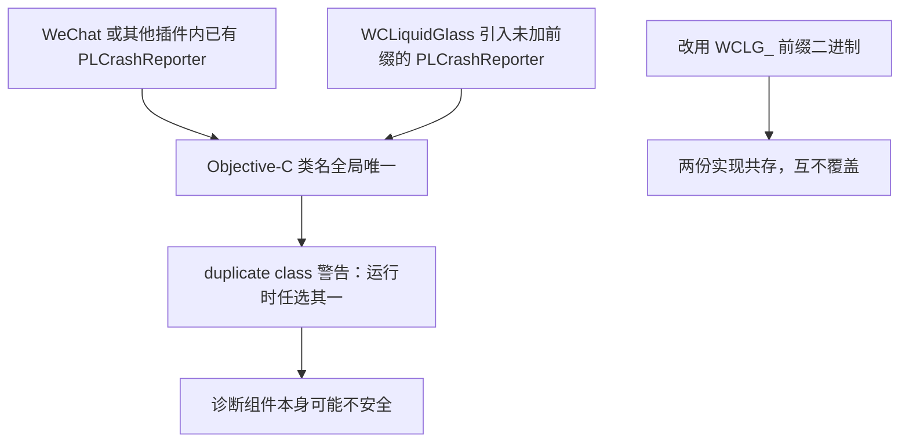

# PLCrashReporter Vendor Integration

完整级崩溃采集依赖 vendored 的 PLCrashReporter 静态库，位于 `Vendor/PLCrashReporter/`：

```text
Vendor/PLCrashReporter/
├── CrashReporter        arm64 iOS 设备静态库
├── Headers/             公共头文件
└── README.md
```

## 版本与许可

来自 `Vendor/PLCrashReporter/README.md`：

> WCLiquidGlass vendors the iOS device static library from Microsoft PLCrashReporter 1.12.0 under its MIT license.

## 符号前缀

二进制是用官方 1.12.0 源码按下面的定义重新编译的：

```sh
GCC_PREPROCESSOR_DEFINITIONS='$(inherited) PLCRASHREPORTER_PREFIX=WCLG_'
```

所以所有导出的 Objective-C 类与 C 符号都带 `WCLG_` 前缀。构建侧必须保持一致，`Makefile` 中：

```make
WCLiquidGlass_CFLAGS = ... -DPLCRASHREPORTER_PREFIX=WCLG_ -I$(THEOS_PROJECT_DIR)/Vendor/PLCrashReporter/Headers
WCLiquidGlass_LDFLAGS = $(THEOS_PROJECT_DIR)/Vendor/PLCrashReporter/CrashReporter
```

源码里照常写 `PLCrashReporter`、`PLCrashReporterConfig`，宏在编译期把它们改写成 `WCLG_` 前缀名。

## 为什么必须加前缀



**不要**用官方发布的未加前缀二进制替换 `CrashReporter`。

## 架构切片

仓库只保存 `arm64` iOS 设备切片，因为本项目只产出 `iphoneos-arm64` tweak（`ARCHS = arm64`）。这也让仓库体积保持较小。

## 运行时的使用方式

- 只在 `WCLiquidGlassPreferences.fullCrashReportsEnabled` 为真、且没有调试器附着时启用。
- 使用 Mach 异常处理，不注册自己的 Objective-C 异常 handler。
- 工作目录在 `Documents/WCLiquidGlass/Diagnostics/Internal/PLCrashReporter`。

详见 [WCLiquidGlassCrashLogger](WCLiquidGlassCrashLogger)。

## 升级步骤

1. 取 PLCrashReporter 新版本源码。
2. 用上面的 `GCC_PREPROCESSOR_DEFINITIONS` 编译 iOS 设备目标。
3. 取出 `arm64` 切片替换 `Vendor/PLCrashReporter/CrashReporter`，同步更新 `Headers/`。
4. 更新 `Vendor/PLCrashReporter/README.md` 中的版本号。
5. 重新构建并验证：设置页打开完整采集 → 重启微信 → 制造一次原生崩溃 → 确认生成 `.crash` 文件。

## 相关页面

- [WCLiquidGlassCrashLogger](WCLiquidGlassCrashLogger)
- [Getting Started and Build System](Getting-Started-and-Build-System)
