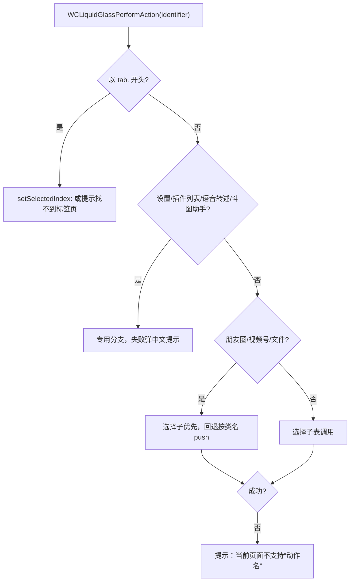

# Page-Aware Action Filtering & Execution

WCLiquidGlass 的动作按「当前页面能否执行」动态显示。核心是一对函数，定义在 `WCLiquidGlassMenu.m`：

```objc
static BOOL WCLiquidGlassCanPerformAction(NSString *actionIdentifier);
static void WCLiquidGlassPerformAction(NSString *actionIdentifier);
```

**检测与执行严格分离**：检测阶段只查找目标、判断类是否存在，绝不调用会产生副作用的方法。

## 可见项计算

```objc
- (NSArray<NSDictionary<NSString *, id> *> *)wc_currentVisibleItems {
    id tabController = WCLiquidGlassCurrentTabController();
    NSString *currentTabAction = tabController
        ? [NSString stringWithFormat:@"tab.%ld", (long)WCLiquidGlassCurrentTabIndex(tabController)]
        : nil;
    for (NSDictionary<NSString *, id> *item in WCLiquidGlassPreferences.buttonItems) {
        NSString *actionIdentifier = item[@"action"];
        BOOL voiceActionStaysAvailable = self.voiceTranscriptionActive &&
            [actionIdentifier isEqualToString:WCLiquidGlassActionVoiceInput];
        BOOL canPerform = voiceActionStaysAvailable || WCLiquidGlassCanPerformAction(actionIdentifier);
        if (![actionIdentifier isEqualToString:currentTabAction] && canPerform) {
            [visibleItems addObject:item];
        }
    }
    return visibleItems.copy;
}
```

调用时机：`reload`、`openMenu`、输入框内容变化、工具栏刷新。语音转述在录制中始终保留，避免用户无法关闭。

## 目标搜索

```objc
static id WCLiquidGlassActionTarget(NSArray<NSString *> *selectorNames) {
    UIViewController *visibleController = WCLiquidGlassVisibleController();
    id tabController = WCLiquidGlassCurrentTabController();
    NSMutableArray *targets = [NSMutableArray arrayWithObjects:visibleController ?: NSNull.null,
                                                           visibleController.navigationController ?: NSNull.null,
                                                           tabController ?: NSNull.null,
                                                           nil];
    for (NSString *propertyName in @[@"hostViewController", @"parentViewController", @"toolView",
                                      @"messageToolBar", @"m_toolView", @"inputToolView",
                                      @"m_inputController"]) {
        id target = WCLiquidGlassObjectFromSelector(visibleController, propertyName);
        if (target) { [targets addObject:target]; }
    }
    for (id target in targets) {
        if (target != NSNull.null && WCLiquidGlassTargetSupportsSelectors(target, selectorNames)) {
            return target;
        }
    }
    return visibleController.viewIfLoaded
        ? WCLiquidGlassTargetInView(visibleController.view, selectorNames)
        : nil;
}
```

搜索顺序：可见控制器 → 其导航控制器 → 当前标签控制器 → 一组输入相关属性 → 视图树递归。全部使用 `NSSelectorFromString` + `respondsToSelector:`，不硬编码类。

## 选择子表

```objc
selectors = @{
    WCLiquidGlassActionChannels: @[@"openFinderTimeline"],
    WCLiquidGlassActionAlbum: @[@"onMediaBrowserClicked:"],
    WCLiquidGlassActionCamera: @[@"onCameraControllerClicked:", @"OpenCameraController"],
    WCLiquidGlassActionVideoCall: @[@"onVideoVoipButtonClicked:"],
    WCLiquidGlassActionRedPacket: @[@"onRedEnvelopesClicked:"],
    WCLiquidGlassActionFiles: @[@"onFileBrowserClicked:", @"onFileBrowser"],
    WCLiquidGlassActionTransfer: @[@"onTransferButtonClicked:"],
    WCLiquidGlassActionLocation: @[@"onLocationButtonClicked:"],
    WCLiquidGlassActionFavorites: @[@"onMyFavoritesButtonClicked:"],
    WCLiquidGlassActionTranslate: @[@"onClickTranslateToolOpenMenu"],
    WCLiquidGlassActionScan: @[@"onScanViewController", @"jumpToCameraScanInTopViewController:"],
    WCLiquidGlassActionPayment: @[@"jumpToOfflinePay"],
    WCLiquidGlassActionContactCard: @[@"onShareCardButtonClicked:"],
    WCLiquidGlassActionSearchRecords: @[@"pushSearchControllerWithCompletion:", @"onSearchItem"],
    WCLiquidGlassActionNewLine: @[@"inputNewLine"],
    WCLiquidGlassActionMention: @[@"atUser"],
    WCLiquidGlassActionFullInput: @[@"jumpToFullScreenVC"]
};
```

调用时按签名参数个数决定调用形式：

```objc
NSMethodSignature *signature = [target methodSignatureForSelector:selector];
@try {
    if (signature.numberOfArguments == 2) { ((void (*)(id, SEL))objc_msgSend)(target, selector); return YES; }
    if (signature.numberOfArguments == 3) { ((void (*)(id, SEL, id))objc_msgSend)(target, selector, nil); return YES; }
} @catch (__unused NSException *exception) { }
```

## 特殊动作

| 动作 | 能力条件 | 执行方式 |
| --- | --- | --- |
| `wcliquidglass_settings` | 存在导航控制器 | `push` 一个 `WCLiquidGlass` 实例 |
| `plugins` | 能实例化 `WCPluginsViewController` | push 该控制器 |
| `moments` | 能实例化 `WCTimeLineViewController` | push 该控制器 |
| `channels` | 选择子命中，否则 `WCFinderTimelineTabViewController` | 先选择子后类名 |
| `files` | 选择子命中，否则 `LMFileBrowserViewController` | 先选择子后类名 |
| `voice_input` | `WCLiquidGlassVoiceTranscriptionControl() != nil` | 触发原生 control，保持菜单常驻 |
| `doutu_assistant` | 插件启用 + 输入框有文字 + 存在 `doutuAction` 目标 | 触发斗图助手 |
| `tab.N` | `WCLiquidGlassCanSelectTab` 且响应 `setSelectedIndex:` | `objc_msgSend(tabController, @selector(setSelectedIndex:), index)` |

`tab.N` 的越界保护：

```objc
static BOOL WCLiquidGlassCanSelectTab(id tabController, NSInteger index) {
    NSArray *sources = WCLiquidGlassPrivateTabSources(tabController);
    NSUInteger tabCount = sources.count;
    if ([tabController isKindOfClass:UITabBarController.class]) {
        tabCount = ((UITabBarController *)tabController).viewControllers.count;
    }
    return index >= 0 && index < (NSInteger)tabCount &&
        [tabController respondsToSelector:NSSelectorFromString(@"setSelectedIndex:")];
}
```

## 执行流程



失败提示统一走 `WCLiquidGlassShowActionError`，例如：

```objc
WCLiquidGlassShowActionError([NSString stringWithFormat:@"当前页面不支持“%@”，请进入对应页面后重试。",
                                                        WCLiquidGlassActionTitle(actionIdentifier)]);
```

## 斗图助手的额外处理

`WCLiquidGlassUpdateDoutuButtonVisibility` 在接管斗图助手时隐藏微信输入栏中的原生按钮，并用 associated object 保存原始 `hidden` 值，关闭后恢复：

```objc
if (shouldHide) {
    if (!originalHidden) { objc_setAssociatedObject(button, &WCLiquidGlassDoutuOriginalHiddenKey, @(button.hidden), OBJC_ASSOCIATION_RETAIN_NONATOMIC); }
    if (!button.hidden) { button.hidden = YES; }
} else if (originalHidden) {
    button.hidden = originalHidden.boolValue;
    objc_setAssociatedObject(button, &WCLiquidGlassDoutuOriginalHiddenKey, nil, OBJC_ASSOCIATION_RETAIN_NONATOMIC);
}
```

## 设计原则

1. 不存在的目标 → 隐藏动作，而不是显示后报错。
2. 找不到目标时给出明确中文提示，绝不「猜一个」选择子调用。
3. 所有 runtime 调用都被 `@try/@catch` 包裹。
4. 检测函数保持廉价：每次开菜单都会执行整表检测。

## 相关页面

- [Action Catalog and Configuration](Action-Catalog-and-Configuration)
- [WeChat Runtime Hooks](WeChat-Runtime-Hooks)
- [Plugin Development Specification](Plugin-Development-Specification)
