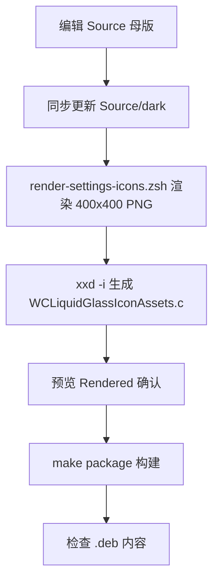

# Settings Icon Build Pipeline

设置页的每个条目都有一张自有图标。图标不是运行时绘制或 tint 的，而是**在构建期以 PNG 字节数组嵌入 dylib**，避免微信沙盒读取外部资源失败。

## 文件布局

```text
Resources/Icons/
├── README.md
├── Source/                     可编辑母版（浅色）
│   ├── Brand.png               已确认的品牌位图母版
│   ├── BrandAction.svg         动作入口专用矢量母版
│   ├── menu.svg size.svg compact-layout.svg actions.svg
│   ├── compatibility.svg crash-capture.svg crash-logs.svg restore.svg
│   └── dark/                   同几何的深色母版
├── Rendered/                   渲染出的透明 PNG（浅色 + -dark）
├── render-settings-icons.zsh   渲染 + 生成 C 数组
├── render-brand-dark.py        由 Brand.png 生成深色 Brand.png
└── render-brand-action.zsh     渲染 BrandAction 预览
WCLiquidGlassIconAssets.c       生成产物，勿手改
WCLiquidGlassIconAssets.h       字节数组声明
```

## 渲染脚本

```zsh
icons=(menu size compact-layout actions compatibility crash-capture crash-logs restore)
mode=${1:-dark}
...
"$renderer" --width 400 --height 400 --output "$rendered/$icon-dark.png" "$project_dir/Resources/Icons/Source/dark/$icon.svg"
```

- 渲染器是 `$(brew --prefix librsvg)/bin/rsvg-convert`，统一 400×400 透明 PNG。
- 默认只重渲染深色；`zsh Resources/Icons/render-settings-icons.zsh all` 同时重渲染浅色。
- `render-brand-dark.py` 从已确认的 `Source/Brand.png` 生成 `Source/dark/Brand.png`。

生成嵌入源文件用 `xxd -i`：

```zsh
{
  print '/* Generated from Resources/Icons/Rendered. Do not edit by hand. */'
  xxd -i -n WCLiquidGlassIconBrand "$rendered/brand.png"
  xxd -i -n WCLiquidGlassIconBrandDark "$rendered/brand-dark.png"
  ...
} > "$project_dir/WCLiquidGlassIconAssets.c"
```

## 固定工作顺序



## 运行时解析

```objc
UIImage *WCLiquidGlassSettingsIconImage(WCLiquidGlassSettingsIconKind kind, CGFloat size) {
    NSString *fileName = WCLiquidGlassSettingsIconFileName(kind);
    if (UITraitCollection.currentTraitCollection.userInterfaceStyle == UIUserInterfaceStyleDark) {
        fileName = [fileName stringByReplacingOccurrencesOfString:@".png" withString:@"-dark.png"];
    }
    return WCLiquidGlassPluginIconAsset(fileName);
}
```

`WCLiquidGlassPluginIconAsset` 的顺序：

1. `NSCache`（`countLimit = 16`）命中直接返回。
2. `WCLiquidGlassEmbeddedIconData(fileName)` 取嵌入字节，`dataWithBytesNoCopy:...freeWhenDone:NO` 零拷贝构造。
3. 回退磁盘路径：

```objc
NSArray<NSString *> *paths = @[
    [@"/var/jb/Library/Application Support/WCLiquidGlass/Icons" stringByAppendingPathComponent:fileName],
    [@"/Library/Application Support/WCLiquidGlass/Icons" stringByAppendingPathComponent:fileName]
];
```

所有图标都以 `UIImageRenderingModeAlwaysOriginal` 返回——图标自带配色，不接受 tint。

`WCLiquidGlassSettingsIconKind` 共九种：`Brand`、`Menu`、`Size`、`CompactLayout`、`Actions`、`Compatibility`、`CrashCapture`、`CrashLogs`、`Restore`，与 `Rendered/` 中的文件一一对应。

## 品牌图标

```objc
UIImage *WCLiquidGlassBrandIconImage(CGFloat size, BOOL includesBackground) {
    BOOL dark = UITraitCollection.currentTraitCollection.userInterfaceStyle == UIUserInterfaceStyleDark;
    return WCLiquidGlassImageWithMaximumSide(WCLiquidGlassPluginIconAsset(dark ? @"brand-dark.png" : @"brand.png"), size);
}
```

`WCLiquidGlassImageWithMaximumSide` 通过调整 `UIImage` 的 `scale` 而非重采样位图来适配目标边长，保持像素锐利。

## 规则

- `WCLiquidGlassIconAssets.c` 是生成文件，任何修改都必须走脚本。
- 深浅色母版必须保持相同几何，只换配色。
- 不在运行时对这些图标做重绘或 tint。

## 相关页面

- [Brand and BrandAction Icon Design](Brand-and-BrandAction-Icon-Design)
- [WeChat Native Icon Resolution](WeChat-Native-Icon-Resolution)
- [Settings UI](Settings-UI)
