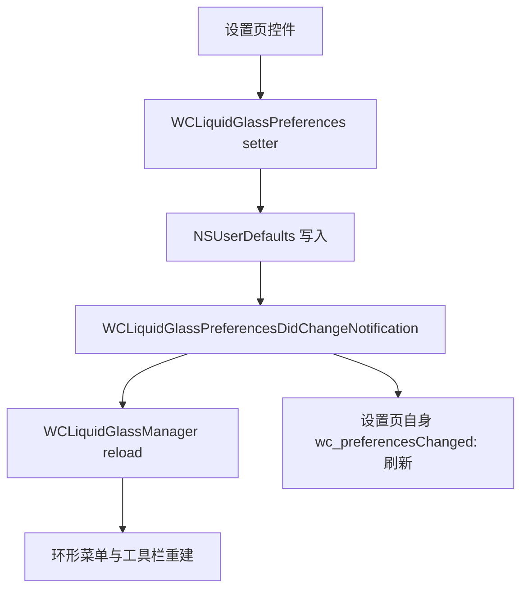

# Settings UI — WCLiquidGlass.m

[`WCLiquidGlass.m`](https://github.com/Ssiswent/WCLiquidGlass/blob/main/WCLiquidGlass.m) 实现四个控制器：

| 类 | 作用 |
| --- | --- |
| `WCLiquidGlass` | 主设置页（注册到 `WCPluginsMgr` 的入口） |
| `WCLiquidGlassButtonEditorController` | 按钮与动作编辑 |
| `WCLiquidGlassActionPickerController` | 动作选择 |
| `WCLiquidGlassCrashLogsController` | 崩溃日志列表与详情 |

全部基于 `UITableViewStyleInsetGrouped`，行高 66 pt（崩溃日志页 76 pt）。

## 视觉系统

- 背景：`WCLiquidGlassBackdropView`（`layerClass` 为 `CAGradientLayer`）作为 `tableView.backgroundView`，同时把 `view` 与 `tableView` 的 `backgroundColor` 设成不透明动态色。
- 卡片：`WCLiquidGlassStyleCardCell` 让每个 section 首尾行带 24 pt 连续圆角，中间行无圆角，构成整段卡片。
- 玻璃：`WCLiquidGlassSettingsEffect()` 优先 `UIGlassEffect`，否则 `UIBlurEffect(SystemMaterial)`。
- 字体：`WCLiquidGlassFont` 使用 `PingFangSC-Semibold` / `PingFangSC-Regular`，取不到则回退系统字体。
- 深浅色：`traitCollectionDidChange:` 中重建 header 并 `reloadData`。

**重要约束**：设置页只提供不透明的表格背景，不去接管微信共享的 `UINavigationBar` 外观。曾经通过修改导航栏 appearance 实现视觉统一，会导致返回微信后导航栏变黑，见仓库内 `docs/solutions/ui-bugs/native-navigation-bar-turns-black-after-scrolling.md`。

## 头部卡片

`wc_makeHeaderView` 构建 164 pt 高的玻璃卡片：58 pt 品牌图标、标题 `WCLiquidGlass`、副标题「为微信打造的模块化交互增强」、版本徽章。

```objc
NSString *displayVersion = [NSString stringWithUTF8String:WCLIQUIDGLASS_VERSION];
displayVersion = [[displayVersion stringByReplacingOccurrencesOfString:@"~" withString:@" "] uppercaseString];
version.text = [NSString stringWithFormat:@"Version %@", displayVersion];
```

版本来自编译期宏，见 [Getting Started and Build System](Getting-Started-and-Build-System)。

## 主设置页结构

```objc
NSArray<NSString *> *titles = @[@"菜单", @"内容", @"兼容性", @"诊断", @"维护"];
```

| Section | 行 | 控件 | 写入 |
| --- | --- | --- | --- |
| 菜单 | 启用全局环形菜单 | `UISwitch` | `setEnabled:` |
| 菜单 | 按钮大小 | 弹出选择 | `setSizeMode:` |
| 菜单 | 紧凑布局 | 弹出选择 | `setCompactLayoutStyle:` |
| 内容 | 输入框工具栏 | `UISwitch` | `setChatToolbarEnabled:` |
| 内容 | 按钮与动作（显示「N 个槽位」） | push 编辑页 | — |
| 兼容性 | WCGlass iOS 27 兼容修复 | `UISwitch` | `setWCGlassIOS27CompatibilityEnabled:` |
| 诊断 | 完整崩溃采集 | `UISwitch` + 提示弹窗 | `setFullCrashReportsEnabled:` |
| 诊断 | 崩溃日志（显示份数或「暂无日志」） | push 日志页 | — |
| 维护 | 恢复默认设置（红色） | 确认后 `restoreDefaults` | — |

选项标题：

```text
按钮大小： 紧凑 · 53pt / 标准 · 60pt / 大 · 66pt
紧凑布局： 双层月牙 / 流动 S 弧 / 宽扇形 / 花瓣环簇
```

各 section 的 footer 说明了行为边界，例如诊断段：

```objc
WCLiquidGlassFooterLabel(@"基础诊断始终开启且不记录聊天内容。完整采集可获得原生线程与二进制镜像信息，重启微信后生效；系统强杀、Jetsam 与看门狗终止可能无法捕获。")
```

开启「完整崩溃采集」后会弹窗提示需重启微信，见 [WCLiquidGlassCrashLogger](WCLiquidGlassCrashLogger)。

## 按钮编辑页

```objc
NSArray<NSString *> *titles = @[@"已添加", @"导航与入口", @"聊天工具", @"管理"];
```

- 「已添加」支持拖动排序与滑动删除（`self.editButtonItem` 在导航栏右侧）。
- 可添加动作分成两组，且过滤掉已添加项：

```objc
NSArray<NSString *> *navigationActions = @[
    WCLiquidGlassActionSettings, WCLiquidGlassActionPlugins,
    WCLiquidGlassActionMoments, WCLiquidGlassActionChannels
];
```

其余目录动作归入「聊天工具」组。上限为：

```objc
static const NSUInteger WCLiquidGlassMaximumButtonCount = 12;
```

- 「管理」段是「恢复默认按钮」，弹窗提示「按钮顺序和已添加动作会恢复，其他设置不受影响」，只调用 `restoreDefaultButtonItems`。
- 任何修改都立刻 `setButtonItems:`，进而发出偏好变化通知，环形菜单实时重载。

## 崩溃日志页

- 数据源为 `WCLiquidGlassCrashLogger.sharedLogger.crashLogURLs`（按修改时间倒序）。
- `.crash` 后缀显示为「完整崩溃报告」，其余为「Objective-C 异常报告」，副标题是本地化时间 + 文件大小。
- 支持查看详情、分享与删除，并监听 `WCLiquidGlassCrashLogsDidChangeNotification` 刷新。

## 数据流



## 相关页面

- [WCLiquidGlassPreferences Persistence Layer](WCLiquidGlassPreferences-Persistence-Layer)
- [Action Catalog and Configuration](Action-Catalog-and-Configuration)
- [Settings Icon Build Pipeline](Settings-Icon-Build-Pipeline)
- [WCLiquidGlassCrashLogger](WCLiquidGlassCrashLogger)
