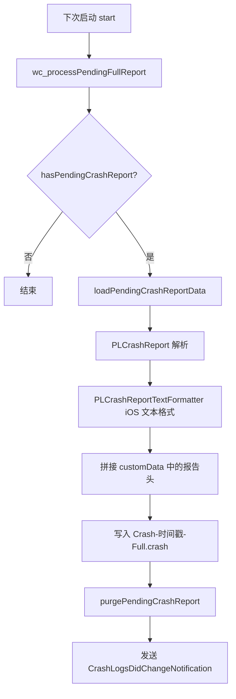

# WCLiquidGlassCrashLogger

[`WCLiquidGlassCrashLogger.m`](https://github.com/Ssiswent/WCLiquidGlass/blob/main/WCLiquidGlassCrashLogger.m) 实现两级崩溃诊断：**基础级**始终开启（纯 Objective-C），**完整级**可选（PLCrashReporter / Mach 异常）。

## 目录布局

```objc
+ (NSURL *)diagnosticsDirectoryURL {
    // Documents/WCLiquidGlass/Diagnostics
}
+ (NSURL *)crashLogsDirectoryURL {
    return [[self diagnosticsDirectoryURL] URLByAppendingPathComponent:@"Crashes" isDirectory:YES];
}
```

```text
Documents/WCLiquidGlass/Diagnostics/
├── Crashes/                       用户可见的日志（.txt 与 .crash）
└── Internal/PLCrashReporter/      PLCrashReporter 的工作目录
```

所有目录都以 `NSFileProtectionCompleteUntilFirstUserAuthentication` 创建。

## 启动

```objc
- (void)start {
    @synchronized (self) { if (self.started) { return; } self.started = YES; }
    [WCLiquidGlassPreferences registerDefaults];
    [self wc_prepareDirectories];
    WCLiquidGlassRecordEvent(@"WCLiquidGlass diagnostics started");
    [self wc_observeLifecycle];
    [self wc_processPendingFullReport];
    [self wc_trimOldLogs];

    WCLiquidGlassActiveCrashLogger = self;
    WCLiquidGlassPreviousExceptionHandler = NSGetUncaughtExceptionHandler();
    NSSetUncaughtExceptionHandler(WCLiquidGlassHandleUncaughtException);

    if (WCLiquidGlassPreferences.fullCrashReportsEnabled && !WCLiquidGlassDebuggerAttached()) {
        [self wc_enableFullCrashReporter];
    }
}
```

`start` 由 `%ctor` 同步调用，尽早接管异常处理。

## 基础级

- 保存上一个 handler 并在处理完后**链式调用**，不吞掉其他崩溃采集插件：

```objc
if (WCLiquidGlassPreviousExceptionHandler &&
    WCLiquidGlassPreviousExceptionHandler != WCLiquidGlassHandleUncaughtException) {
    WCLiquidGlassPreviousExceptionHandler(exception);
}
```

- 输出文件 `Crash-<timestamp>-ObjectiveC.txt`，内容为报告头 + 异常名、reason、userInfo、`callStackSymbols`。
- 生命周期事件环形缓冲最多 30 条，`@synchronized` 保护：

```objc
[events addObject:[NSString stringWithFormat:@"%@  %@", NSDate.date, event]];
if (events.count > 30) {
    [events removeObjectsInRange:NSMakeRange(0, events.count - 30)];
}
```

被记录的通知包括 `DidBecomeActive`、`WillResignActive`、`DidEnterBackground`、`WillEnterForeground`、`DidReceiveMemoryWarning`、`WillTerminate`；`Tweak.xm` 的 WCGlass 防护也通过 `recordEvent:` 写入事件。

## 报告头

`WCLiquidGlassReportHeader` 收集：采集级别、生成时间、WCLiquidGlass 版本、微信版本与构建号、iOS 版本、设备型号（`uname`）、进程运行时长、应用状态、最近事件、已加载注入 dylib 列表。

dylib 列表通过 `_dyld_image_count()` 枚举，只保留位于 `/Library/MobileSubstrate/`、`/var/jb/`、`/usr/lib/TweakInject/`、`WeChat.app/Frameworks/` 的 `.dylib`，用于判断是否与其他插件冲突。

**不记录任何聊天内容。**

## 完整级

```objc
PLCrashReporterConfig *config = [[PLCrashReporterConfig alloc]
                                initWithSignalHandlerType:PLCrashReporterSignalHandlerTypeMach
                                symbolicationStrategy:PLCrashReporterSymbolicationStrategyNone
                                shouldRegisterUncaughtExceptionHandler:NO
                                basePath:basePath
                                maxReportBytes:5 * 1024 * 1024];
```

- `shouldRegisterUncaughtExceptionHandler:NO`：Objective-C 异常仍由基础级处理，避免双重接管。
- 调试器附着时不启用（`WCLiquidGlassDebuggerAttached` 用 `sysctl` 检查 `P_TRACED`）。
- 报告头写入 `reporter.customData`，并在每次生命周期通知时刷新，因此崩溃报告里的状态是崩溃前最新的。
- 开关改变需要重启微信才生效，设置页会弹窗说明。

## 待处理报告的转换



只有写入成功才 purge，避免转换失败时丢报告。

## 日志管理

- `crashLogURLs` 按修改时间倒序返回。
- 保留上限 20 份，超出部分在 `start` 时清理。
- `deleteLogAtURL:error:` 会做路径前缀校验，只允许删除 `Crashes/` 目录内的文件：

```objc
if (![targetPath hasPrefix:[logsPath stringByAppendingString:@"/"]]) { ... }
```

- 列表变化统一通过 `WCLiquidGlassCrashLogsDidChangeNotification` 通知设置页。

## 已知限制

系统强杀、Jetsam（内存压力）与看门狗终止不会产生崩溃报告——这是设置页诊断段 footer 明确写出的说明。

## 相关页面

- [PLCrashReporter Vendor Integration](PLCrashReporter-Vendor-Integration)
- [Settings UI](Settings-UI)
- [iOS 27 Compatibility Guard](iOS-27-Compatibility-Guard)
