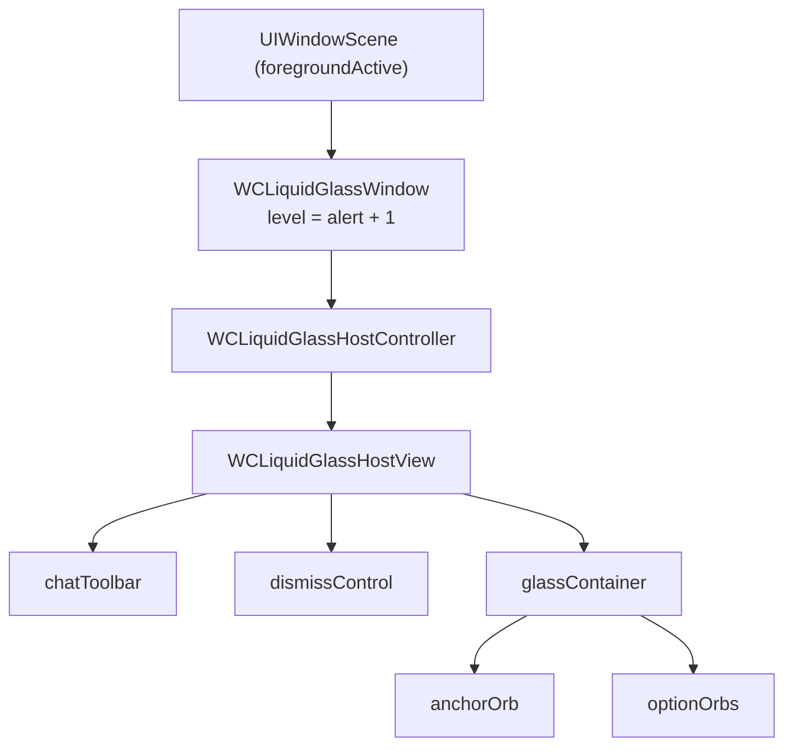

# WCLiquidGlassManager & Window Layer

`WCLiquidGlassManager` 是覆盖层的唯一入口。虽然对外声明在 [`WCLiquidGlassMenu.h`](https://github.com/Ssiswent/WCLiquidGlass/blob/main/WCLiquidGlassMenu.h)，但**没有单独的 `WCLiquidGlassManager.m`**：实现位于 `WCLiquidGlassMenu.m` 文件末尾（约 3451–3606 行），和 `WCLiquidGlassWindow`、`WCLiquidGlassHostController` 一起。

## 公开接口

```objc
@interface WCLiquidGlassManager : NSObject
+ (instancetype)sharedManager;
- (void)start;
- (void)reload;
- (void)refreshChatToolbar;
- (void)hideChatToolbarImmediately;
- (void)resumeChatToolbar;
- (void)resumeChatToolbarImmediately;
- (void)beginChatToolbarAppearanceTransition;
- (void)endChatToolbarAppearanceTransition;
@end
```

除 `start` 由 `%ctor` 调用外，其余大多由 `Tweak.xm` 的聊天生命周期 hook 调用，见 [WeChat Runtime Hooks](WeChat-Runtime-Hooks)。

## start / reload

```objc
- (void)start {
    if (self.started) {
        [self reload];
        return;
    }
    self.started = YES;
    [WCLiquidGlassPreferences registerDefaults];
    // 观察 UIApplicationWillResignActive / UIApplicationDidBecomeActive /
    // WCLiquidGlassPreferencesDidChangeNotification
    [self reload];
}

- (void)reload {
    dispatch_async(dispatch_get_main_queue(), ^{
        WCLiquidGlassRefreshDoutuConfiguration();
        [self wc_ensureWindow];
        [self.hostController.hostView reload];
        self.window.hidden = !WCLiquidGlassPreferences.enabled;
    });
}
```

- 偏好变化只触发 `reload`，不重建窗口（除非 scene 变了）。
- 进入后台（`willResignActive`）会立即收起菜单：`wc_resetMenuImmediately`。
- 回到前台（`didBecomeActive`）重新 `reload`，重新解析微信控制器与图标。

## 窗口创建

```objc
- (void)wc_ensureWindow {
    // 取第一个 foregroundActive 的 UIWindowScene
    if (self.window && self.window.windowScene == activeScene) {
        return;
    }
    self.hostController = [[WCLiquidGlassHostController alloc] init];
    self.window = [[WCLiquidGlassWindow alloc] initWithWindowScene:activeScene];
    self.window.frame = activeScene.coordinateSpace.bounds;
    self.window.rootViewController = self.hostController;
    self.window.backgroundColor = UIColor.clearColor;
    self.window.windowLevel = UIWindowLevelAlert + 1.0;
    self.window.hidden = YES;
}
```

| 属性 | 值 | 原因 |
| --- | --- | --- |
| `windowLevel` | `UIWindowLevelAlert + 1.0` | 保证浮在微信页面与常规弹层之上 |
| `backgroundColor` | `clearColor` | 只显示 orb 与工具栏 |
| `hidden` | 由 `WCLiquidGlassPreferences.enabled` 决定 | 关闭插件时完全不参与事件链 |
| scene | 前台 active 的 `UIWindowScene` | 避免在后台 scene 上创建窗口 |

## 触摸穿透

窗口与 HostView 各拦一层：

```objc
@implementation WCLiquidGlassWindow
- (BOOL)canBecomeKeyWindow { return NO; }

- (UIView *)hitTest:(CGPoint)point withEvent:(UIEvent *)event {
    UIView *hitView = [super hitTest:point withEvent:event];
    return hitView == self ? nil : hitView;
}
@end
```

HostView 的 `hitTest:` 按优先级依次判定聊天工具栏、动作 orb（逆序，顶层优先）、锚点 orb，最后：

```objc
return self.menuOpen ? self.dismissControl : nil;
```

结果：菜单收起时，除 orb 与工具栏本身外的所有触摸都落回微信；键盘、列表滚动、侧滑返回都不受影响。因为窗口拒绝成为 key window，输入焦点也不会被抢走。

## 层级与线程模型



线程规则：`reload`/`refreshChatToolbar` 使用 `dispatch_async(main)`；`hideChatToolbarImmediately`、`resumeChatToolbar(Immediately)`、`begin/endChatToolbarAppearanceTransition` 先判断 `NSThread.isMainThread`，主线程上同步执行，避免转场期间出现一帧错位。

`refreshChatToolbar` 使用 `chatToolbarRefreshQueued` 合并同一 run loop 内的多次请求——`MMInputToolView layoutSubviews` 每帧都可能触发。

## 相关页面

- [Orb Layout Engine and Gesture Handling](Orb-Layout-Engine-and-Gesture-Handling)
- [Chat Toolbar Sub-system](Chat-Toolbar-Sub-system)
- [Architecture Overview](Architecture-Overview)
