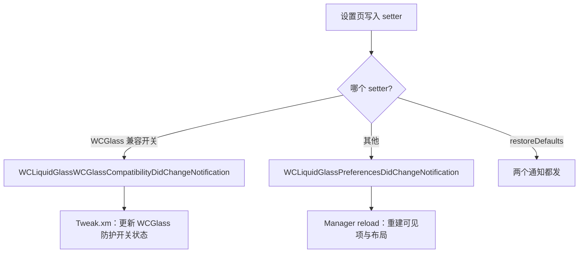

# WCLiquidGlassPreferences — Persistence Layer

`WCLiquidGlassPreferences` 是纯类方法门面，底层是微信沙盒内的 `NSUserDefaults.standardUserDefaults`。没有 plist 文件、没有 `CFPreferences` 跨进程通知，因为设置页与菜单运行在同一个微信进程内。

## 键名

```objc
static NSString *const WCLiquidGlassEnabledKey = @"WCLiquidGlass.Enabled";
static NSString *const WCLiquidGlassSizeModeKey = @"WCLiquidGlass.SizeMode";
static NSString *const WCLiquidGlassCompactLayoutStyleKey = @"WCLiquidGlass.CompactLayoutStyle";
static NSString *const WCLiquidGlassAnchorOnLeftKey = @"WCLiquidGlass.Anchor.OnLeft";
static NSString *const WCLiquidGlassAnchorYKey = @"WCLiquidGlass.Anchor.YFraction";
static NSString *const WCLiquidGlassFullCrashReportsEnabledKey = @"WCLiquidGlass.Diagnostics.FullCrashReportsEnabled";
static NSString *const WCLiquidGlassWCGlassIOS27CompatibilityEnabledKey = @"WCLiquidGlass.Compatibility.WCGlassIOS27ReturnCrashFixEnabled";
static NSString *const WCLiquidGlassChatToolbarEnabledKey = @"WCLiquidGlass.ChatToolbarEnabled";
static NSString *const WCLiquidGlassButtonItemsKey = @"WCLiquidGlass.ButtonItems";
static NSString *const WCLiquidGlassLegacySearchRecordsMigrationKey = @"WCLiquidGlass.Migration.SearchRecordsAdded";
static NSString *const WCLiquidGlassSearchRecordsMigrationKey = @"WCLiquidGlass.Migration.SearchRecordsAdded.V2";
```

## 默认值

```objc
+ (void)registerDefaults {
    [NSUserDefaults.standardUserDefaults registerDefaults:@{
        WCLiquidGlassEnabledKey: @NO,
        WCLiquidGlassSizeModeKey: @1,
        WCLiquidGlassCompactLayoutStyleKey: @(WCLiquidGlassCompactLayoutStyleDoubleCrescent),
        WCLiquidGlassAnchorOnLeftKey: @NO,
        WCLiquidGlassAnchorYKey: @0.62,
        WCLiquidGlassFullCrashReportsEnabledKey: @NO,
        WCLiquidGlassWCGlassIOS27CompatibilityEnabledKey: @YES,
        WCLiquidGlassChatToolbarEnabledKey: @YES,
        WCLiquidGlassButtonItemsKey: WCLiquidGlassDefaultButtonItems()
    }];
    WCLiquidGlassMigrateButtonItemsIfNeeded();
}
```

| 键 | 默认 | 说明 |
| --- | --- | --- |
| `Enabled` | `NO` | 环形菜单默认关闭，安装后不改变微信行为 |
| `SizeMode` | `1` | 标准 60 pt |
| `CompactLayoutStyle` | `0` | 双层月牙 |
| `Anchor.OnLeft` | `NO` | 默认贴右 |
| `Anchor.YFraction` | `0.62` | 屏幕高度的 62% |
| `Diagnostics.FullCrashReportsEnabled` | `NO` | PLCrashReporter 默认不启用 |
| `Compatibility.WCGlassIOS27ReturnCrashFixEnabled` | `YES` | 默认开启，仅在 iOS 27+ 生效 |
| `ChatToolbarEnabled` | `YES` | 输入框工具栏默认开启 |
| `ButtonItems` | 插件列表 + 搜索记录 | 见 [Action Catalog and Configuration](Action-Catalog-and-Configuration) |

## 读取时钳制

所有读取器都做防御性钳制，因此损坏或越界的值不会传播到布局代码：

```objc
+ (NSInteger)sizeMode {
    return MIN(2, MAX(0, [NSUserDefaults.standardUserDefaults integerForKey:WCLiquidGlassSizeModeKey]));
}

+ (WCLiquidGlassCompactLayoutStyle)compactLayoutStyle {
    NSInteger style = [NSUserDefaults.standardUserDefaults integerForKey:WCLiquidGlassCompactLayoutStyleKey];
    return MIN(WCLiquidGlassCompactLayoutStylePetalCluster,
               MAX(WCLiquidGlassCompactLayoutStyleDoubleCrescent, style));
}
```

锚点 y 比例限制在 `0.1 ... 0.9`，避免锚点被拖到状态栏或 Home 指示条下。

## 按钮项校验

```objc
+ (NSArray<NSDictionary<NSString *, id> *> *)buttonItems {
    NSArray *storedItems = [NSUserDefaults.standardUserDefaults arrayForKey:WCLiquidGlassButtonItemsKey];
    if (![storedItems isKindOfClass:NSArray.class] || storedItems.count == 0) {
        return WCLiquidGlassDefaultButtonItems();
    }
    for (id item in storedItems) {
        if (![item isKindOfClass:NSDictionary.class] ||
            ![item[@"slot"] isKindOfClass:NSString.class] ||
            ![item[@"action"] isKindOfClass:NSString.class]) {
            continue;
        }
        if (WCLiquidGlassActionWasRemoved(item[@"action"])) { continue; }
        [validItems addObject:item];
    }
    return validItems.count == 0 ? WCLiquidGlassDefaultButtonItems() : validItems.copy;
}
```

三重保护：类型校验、下线动作过滤、空结果回退默认。

## 变更通知



`restoreDefaults` 显式移除全部九个设置键与两个迁移标记，然后发送两个通知：

```objc
[defaults removeObjectForKey:WCLiquidGlassLegacySearchRecordsMigrationKey];
[defaults removeObjectForKey:WCLiquidGlassSearchRecordsMigrationKey];
WCLiquidGlassNotifyPreferencesChanged();
[NSNotificationCenter.defaultCenter postNotificationName:WCLiquidGlassWCGlassCompatibilityDidChangeNotification object:nil];
```

`restoreDefaultButtonItems` 只清 `ButtonItems`，其他设置不受影响（对应设置页「恢复默认按钮」）。

## 相关页面

- [Settings UI](Settings-UI)
- [Action Catalog and Configuration](Action-Catalog-and-Configuration)
- [Orb Layout Engine and Gesture Handling](Orb-Layout-Engine-and-Gesture-Handling)
