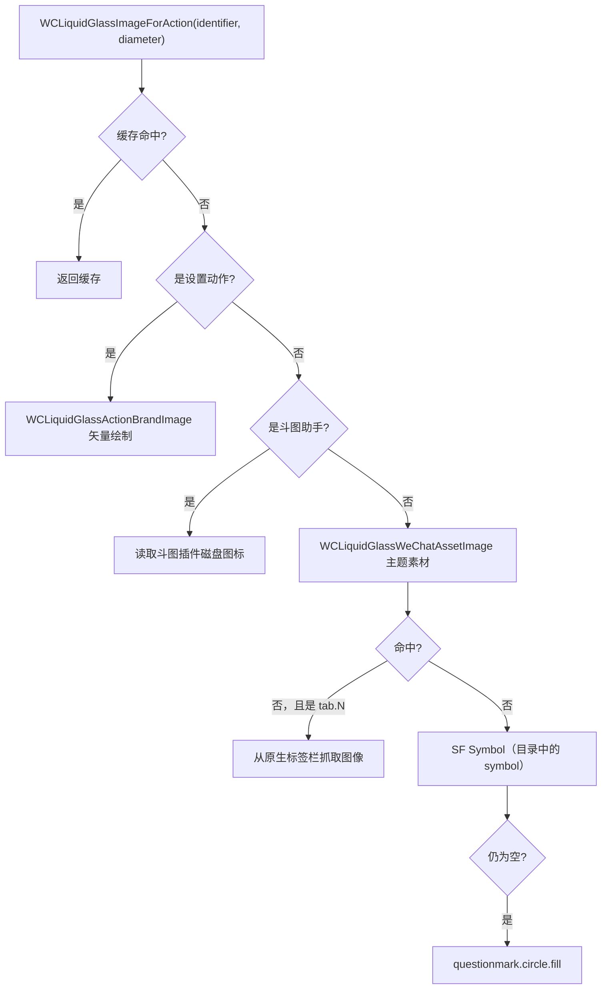

# WeChat Native Icon Resolution

orb 与聊天工具栏上的动作图标优先使用**微信自己的素材**，让插件外观与宿主一致。解析逻辑集中在 `WCLiquidGlassImageForAction`（`WCLiquidGlassMenu.m`）。

## 解析顺序



缓存键包含动作、直径与界面风格：

```objc
NSString *cacheKey = [NSString stringWithFormat:@"%@|%.1f|%ld",
                                                actionIdentifier, buttonDiameter, (long)interfaceStyle];
```

`NSCache` 上限 96 项，深浅色切换会自然产生不同键。

## 主题素材查询

```objc
static UIImage *WCLiquidGlassImageNamedFromCandidates(NSArray<NSString *> *assetNames) {
    id themeManager = WCLiquidGlassThemeManager();
    SEL svgSelector = NSSelectorFromString(@"svgImageNamed:color:");
    for (NSString *assetName in assetNames) {
        NSString *drawerAssetName = [NSString stringWithFormat:@"drawer_%@", assetName];
        if ([themeManager respondsToSelector:svgSelector]) {
            for (NSString *name in @[drawerAssetName, assetName]) {
                @try {
                    UIImage *image = ((id (*)(id, SEL, id, id))objc_msgSend)(themeManager, svgSelector, name,
                                                                            WCLiquidGlassDynamicIconColor());
                    if (image) { return image; }
                } @catch (__unused NSException *exception) { }
            }
        }
        UIImage *image = [UIImage imageNamed:drawerAssetName] ?: [UIImage imageNamed:assetName];
        if (image) { return [image imageWithRenderingMode:UIImageRenderingModeAlwaysOriginal]; }
    }
    return nil;
}
```

- 主题管理器通过 `MMServiceCenter defaultCenter → getService:MMThemeManager` 获取，全程 `respondsToSelector:` + `@try`。
- 每个候选名先试 `drawer_` 前缀（微信「+」抽屉里的同款图标），再试原名。
- 颜色随深浅色在黑/白之间切换：`WCLiquidGlassDynamicIconColor`。
- 候选名列表来自 `WCLiquidGlassActionAssetNames`，见 [Action Catalog and Configuration](Action-Catalog-and-Configuration)。

## 标签页图标

`tab.N` 没有固定素材名，需要从运行中的标签栏取：

```objc
static UIImage *WCLiquidGlassNativeTabImage(id tabController, NSInteger index) {
    NSArray *sources = WCLiquidGlassPrivateTabSources(tabController);  // 私有 tab 数据源
    ...
    sources = WCLiquidGlassNativeTabSources(systemTabController);       // tabBar 上的按钮视图
    ...
    UITabBarItem *item = systemTabController.tabBar.items[index];       // 最后用 UITabBarItem
    UIImage *image = item.selectedImage ?: item.image;
}
```

`WCLiquidGlassNativeTabSources` 只挑宽度 ≥ 20 pt、且是 `UIControl` 或类名包含 `TabBarButton` 且内部有可用 `UIImageView` 的子视图，并按中心 x 排序，保证顺序与视觉一致。

从任意对象取图使用有界递归：

```objc
static UIImage *WCLiquidGlassImageFromSourceAtDepth(id source, NSUInteger depth) {
    if (!source || depth > 5) { return nil; }
    if ([source isKindOfClass:UIImage.class]) { return source; }
    for (NSString *selectorName in @[@"item", @"iconView", @"imageView"]) { ... }
    for (NSString *selectorName in @[@"highlightImage", @"selectedImage", @"icon", @"image", @"iconImage"]) { ... }
    if ([source isKindOfClass:UIView.class]) { return WCLiquidGlassNativeImageViewInView(source).image; }
}
```

视图树扫描只接受 10–64 pt 的 `UIImageView`，并取面积最大者，避免抓到背景或装饰图。

## 渲染模式

- 微信素材与标签页图标使用 `AlwaysOriginal`，保留原配色。
- SF Symbol 兜底与「插件列表」使用 `AlwaysTemplate`，跟随文字色。
- SF Symbol 尺寸为 `floor(buttonDiameter * 0.34)`，`Semibold`。

## 斗图助手图标

从斗图插件的安装路径按深浅色顺序尝试多个文件名：

```objc
NSArray<NSString *> *fileNames = dark
    ? @[@"dt_dark_icon.png", @"dt_icon_dark.png", @"dt_icon.png"]
    : @[@"dt_icon.png", @"dt_dark_icon.png", @"dt_icon_dark.png"];
```

搜索 `/var/jb/Library/PreferenceLoader/Preferences`、`/Library/PreferenceLoader/Preferences` 与微信 bundle 目录。

## 关闭图标

`WCLiquidGlassCloseImage` 先试 `icons_outlined_close` 等候选名，全部失败时用 `UIBezierPath` 现画一个 32×32 的叉，保证任何微信版本下都有图标。

## 相关页面

- [Settings Icon Build Pipeline](Settings-Icon-Build-Pipeline)
- [Brand and BrandAction Icon Design](Brand-and-BrandAction-Icon-Design)
- [Page-Aware Action Filtering and Execution](Page-Aware-Action-Filtering-and-Execution)
