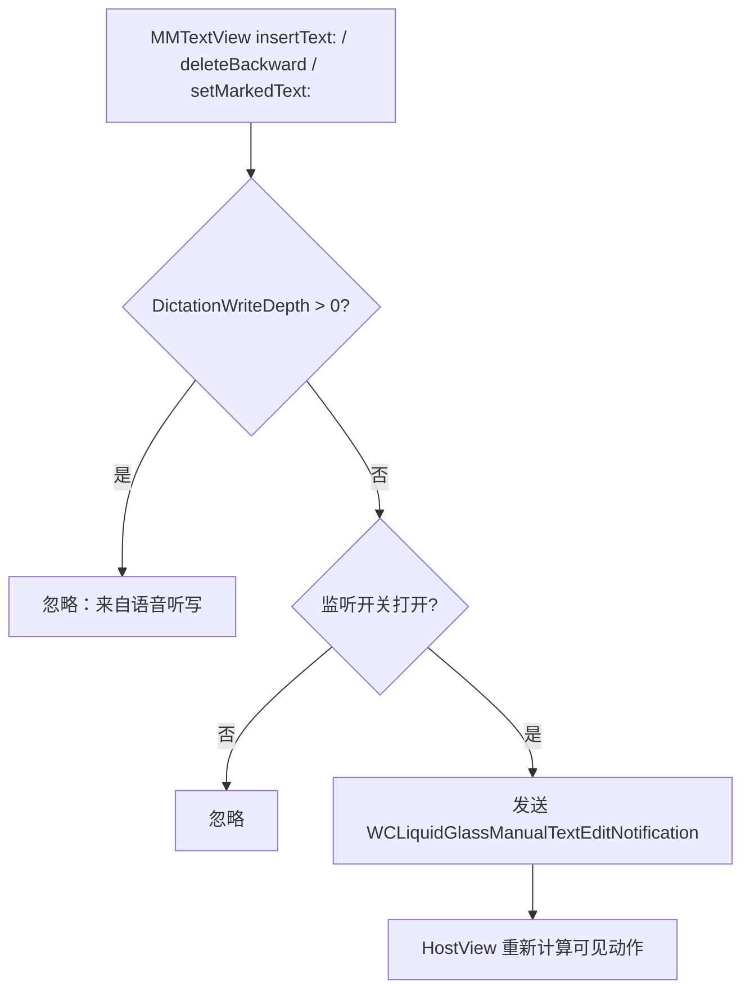

# WeChat Runtime Hooks (Tweak.xm)

[`Tweak.xm`](https://github.com/Ssiswent/WCLiquidGlass/blob/main/Tweak.xm) 是唯一使用 Logos 语法与 `MSHookMessageEx` 的文件，包含四类内容：进程引导、输入区/聊天页 hook、文本编辑来源追踪、iOS 27 兼容防护（后者单独见 [iOS 27 Compatibility Guard](iOS-27-Compatibility-Guard)）。

## 引导

```objc
%ctor {
    @autoreleasepool {
        if (![NSBundle.mainBundle.bundleIdentifier isEqualToString:@"com.tencent.xin"]) {
            return;
        }
        [WCLiquidGlassCrashLogger.sharedLogger start];
        [WCLiquidGlassPreferences registerDefaults];
        dispatch_async(dispatch_get_main_queue(), ^{
            WCLiquidGlassInstallWCGlassReturnHooksIfNeeded();
            [WCLiquidGlassManager.sharedManager start];
            WCLiquidGlassTryRegisterPlugin();
        });
    }
}
```

崩溃日志与偏好在 `%ctor` 同步初始化（要尽早接管异常处理），UI 相关工作全部放到主队列。

## Logos hook 一览

| Hook | 方法 | 作用 |
| --- | --- | --- |
| `MMInputToolView` | `layoutSubviews` | 每次输入区布局后刷新斗图按钮可见性与聊天工具栏 |
| `BaseMsgContentViewController` | `viewWillAppear:` / `viewDidAppear:` / `viewWillDisappear:` / `viewDidDisappear:` | 聊天页转场时控制工具栏显隐 |
| `MMGrowTextView` | `MMDictationLogicIcon_replaceRange:withText:` | 标记「语音听写写入」作用域 |
| `MMTextView` | `insertText:` / `deleteBackward` / `setMarkedText:selectedRange:` | 上报用户手动编辑 |

### 输入区布局

```objc
%hook MMInputToolView
- (void)layoutSubviews {
    %orig;
    WCLiquidGlassUpdateDoutuButtonVisibility(self);
    [WCLiquidGlassManager.sharedManager refreshChatToolbar];
}
%end
```

`refreshChatToolbar` 内部做同 run loop 合并，所以高频调用是安全的。

### 聊天页生命周期

```objc
%hook BaseMsgContentViewController
- (void)viewWillDisappear:(BOOL)animated {
    [WCLiquidGlassManager.sharedManager hideChatToolbarImmediately];
    %orig;
}
- (void)viewWillAppear:(BOOL)animated {
    [WCLiquidGlassManager.sharedManager beginChatToolbarAppearanceTransition];
    %orig;
    [WCLiquidGlassManager.sharedManager resumeChatToolbarImmediately];
    // transitionCoordinator 完成后 endChatToolbarAppearanceTransition
}
%end
```

## 手动编辑 vs 语音听写

语音转述会不断改写输入框文字。如果把这些写入当成「用户在打字」，菜单/工具栏会反复重算可见动作。解决办法是用线程局部深度计数区分来源：

```objc
static __thread NSUInteger WCLiquidGlassDictationWriteDepth = 0;

%hook MMGrowTextView
- (void)MMDictationLogicIcon_replaceRange:(NSRange)range withText:(NSString *)text {
    WCLiquidGlassDictationWriteDepth += 1;
    @try {
        %orig;
    } @finally {
        WCLiquidGlassDictationWriteDepth -= 1;
    }
}
%end

static void WCLiquidGlassReportManualTextEdit(id inputView) {
    if (WCLiquidGlassDictationWriteDepth > 0 || !WCLiquidGlassShouldReportManualTextEdit()) {
        return;
    }
    [NSNotificationCenter.defaultCenter postNotificationName:WCLiquidGlassManualTextEditNotification
                                                      object:inputView];
}
```

`@finally` 保证异常路径下计数也会回退；`WCLiquidGlassShouldReportManualTextEdit()` 由 HostView 在有监听需求时才打开，无人关心时完全不发通知。



## 插件注册

设置页要出现在 `WCPluginsMgr` 的插件列表里：

```objc
SEL registerSelector = NSSelectorFromString(@"registerControllerWithTitle:version:controller:");
```

`WCLiquidGlassTryRegisterPlugin` 的规则：

1. `NSClassFromString(@"WCPluginsMgr")` 与 `sharedInstance` 都存在才继续。
2. 用 `methodSignatureForSelector:` 校验签名参数个数。
3. 传入标题 `WCLiquidGlass`、版本 `WCLIQUIDGLASS_VERSION`（来自 `control`）、控制器类名 `WCLiquidGlass`。
4. 失败则每秒重试一次，最多 15 次：

```objc
if (WCLiquidGlassPluginRegistered || WCLiquidGlassRegistrationAttempts >= 15) {
    return;
}
```

因为微信的插件管理器可能在 tweak 加载之后才就绪，重试比一次性注册更可靠；上限避免无限定时器。

## 相关页面

- [Chat Toolbar Sub-system](Chat-Toolbar-Sub-system)
- [iOS 27 Compatibility Guard](iOS-27-Compatibility-Guard)
- [Settings UI](Settings-UI)
