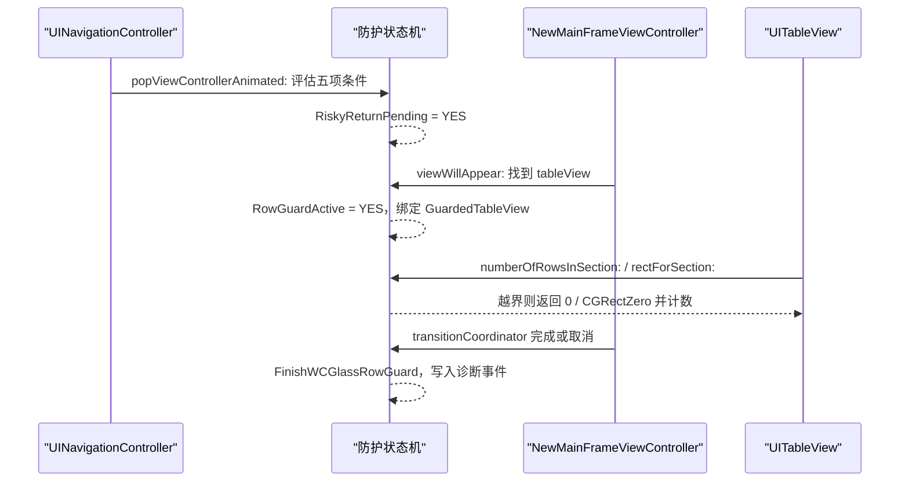

# iOS 27 Compatibility Guard (WCGlass Return Fix)

在 iOS 27 上，与 WCGlass（提供 `WCLGHomeGroups` 的插件）共存时，从带键盘且输入框有文字的聊天页返回微信主页面，`NewMainFrameViewController` 的 `UITableView` 会向已经失效的 section 请求行数/矩形，触发越界崩溃。WCLiquidGlass 在 `Tweak.xm` 中提供一个**只读、限时、限对象**的防护。

设置项：「兼容性 → WCGlass iOS 27 兼容修复」，默认开启，仅在满足全部条件时才起作用。

## 触发条件

```objc
BOOL shouldStabilizeWCGlassReturn =
    NSProcessInfo.processInfo.operatingSystemVersion.majorVersion >= 27 &&
    WCLiquidGlassPreferences.wcGlassIOS27CompatibilityEnabled &&
    WCLiquidGlassKeyboardVisible &&
    WCLiquidGlassIsAffectedChatController(topViewController) &&
    WCLiquidGlassCurrentChatInputHasText();
```

```objc
static BOOL WCLiquidGlassIsAffectedChatController(UIViewController *viewController) {
    Class chatControllerClass = NSClassFromString(@"BaseMsgContentViewController");
    return NSClassFromString(@"WCLGHomeGroups") != Nil &&
        chatControllerClass != Nil &&
        [viewController isKindOfClass:chatControllerClass];
}
```

没有 WCGlass、系统低于 iOS 27、键盘未弹出或输入框为空时，防护完全不参与。

## 安装的 hook

`WCLiquidGlassInstallWCGlassReturnHooksIfNeeded` 用 `MSHookMessageEx` 动态安装四个 hook（不是 Logos `%hook`，因为要按运行时条件决定是否安装）：

| 目标 | 方法 | 作用 |
| --- | --- | --- |
| `UINavigationController` | `popViewControllerAnimated:` | 判定本次返回是否有风险，置 `RiskyReturnPending` |
| `NewMainFrameViewController` | `viewWillAppear:` | 开启行防护、绑定目标 table view、注册结束时机 |
| `UITableView` | `numberOfRowsInSection:` | 越界 section 返回 `0` |
| `UITableView` | `rectForSection:` | 越界 section 返回 `CGRectZero` |

```objc
MSHookMessageEx(UINavigationController.class,
                popSelector,
                (IMP)&WCLiquidGlassStableNavigationPopViewController,
                (IMP *)&WCLiquidGlassOriginalNavigationPopViewController);
```

若 `NewMainFrameViewController` 或任一方法尚未就绪，则每 0.5 秒重试，最多 10 次。

## 生命周期



结束时机三选一：转场完成、转场取消，或没有 transition coordinator 时的下一个 main run loop：

```objc
} else {
    dispatch_async(dispatch_get_main_queue(), ^{
        WCLiquidGlassFinishWCGlassRowGuard(@"next run loop");
    });
}
```

`viewWillAppear:` 原实现抛异常时，`@catch` 里先结束防护再 `@throw`，防止状态泄漏。

## 越界判定

```objc
static BOOL WCLiquidGlassShouldGuardOutOfBoundsSection(UITableView *tableView, NSInteger section) {
    BOOL activeTarget = WCLiquidGlassWCGlassRowGuardActive &&
        tableView == WCLiquidGlassWCGlassGuardedTableView;
    if (!activeTarget && !WCLiquidGlassPreferences.wcGlassIOS27CompatibilityEnabled) { return NO; }
    BOOL knownTarget = tableView == WCLiquidGlassWCGlassKnownMainFrameTableView;
    if (!activeTarget && !knownTarget && section >= 0 && section < 2) { return NO; }
    NSInteger sectionCount = tableView.numberOfSections;
    if (section >= 0 && section < sectionCount) { return NO; }   // 合法请求一律放行
    if (activeTarget) { return YES; }
    ...
}
```

关键性质：

1. **合法 section 永远走原实现**，防护只拦截真正越界的请求。
2. 防护窗口外还有一层兜底：只对确认属于 `NewMainFrameViewController` 的 table view 生效（`WCLiquidGlassIsMainFrameTableView` 沿 responder 链与场景窗口树递归查找，深度上限 16）。
3. 兜底路径只记录一次日志（`FallbackGuardLogged`），避免刷屏。

## 可观测性

防护结束时写入诊断事件，可在设置页崩溃日志里看到：

```objc
@"WCGlassReturn row guard end reason=%@ blockedRows=%lu blockedRects=%lu"
```

配合 begin 事件中的 `sections=` 数量，可以判断防护是否真的介入过。

## 明确不做的事

- 不修改数据源、section 数量或 cell 内容
- 不改变导航时机、动画或键盘状态
- 不隐藏、插入或替换任何视图
- 不在非 iOS 27、无 WCGlass 环境下安装 hook

## 相关页面

- [WeChat Runtime Hooks](WeChat-Runtime-Hooks)
- [WCLiquidGlassCrashLogger](WCLiquidGlassCrashLogger)
- [Settings UI](Settings-UI)
